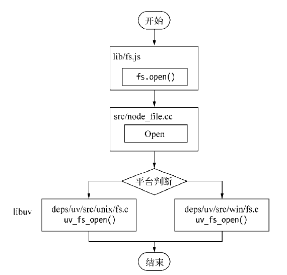

# NodeJS 中非阻塞 I/O、异步 I/O

## 什么是 I/O ?

首先，我想有必要把 I/O 的概念解释一下。I/O 即 Input/Output, 输入和输出的意思。在浏览器端，只有一种 I/O，那就是利用 Ajax 发送网络请求，然后读取返回的内容，这属于网络 I/O。回到 nodejs 中，其实这种的 I/O 的场景就更加广泛了，主要分为两种:

- 文件 I/O: 比如用 fs 模块对文件进行读写操作。
- 网络 I/O: 比如 http 模块发起网络请求。

## 什么是阻塞和非阻塞 I/O ?

操作系统内核对于 I/O 只有两种方式，就是阻塞和非阻塞。

### 阻塞 I/O

在调用阻塞 I/O 的时候，应用程序需要等待 I/O 完成才返回结果。

阻塞 I/O 的特点是调用之后一定要等到系统内核层面完成所有操作后，调用才结束。阻塞 I/O 造成 CPU 等待 I/O，浪费等待时间，CPU 的处理能力不能得到充分利用。

### 非阻塞 I/O

为了性能，内核提供了非阻塞 I/O。非阻塞 I/O 和阻塞 I/O 的差别为调用之后会立即返回。

以文件 I/O 操作为例，内核在进行文件 I/O 操作的时候，通过文件描述符进行管理，应用程序如需要进行 I/O 调用，需要先打开文件描述符，然后再根据文件描述符去进实现文件的数据读写。阻塞 I/O 会完成整个获取数据的过程，然后携带数据返回，而非阻塞 I/O 则不带数据返回，要获取数据，还要通过文件描述符再次读取。

## 轮询

对前者而言，在操作系统进行 I/O 的操作的过程中，我们的应用程序其实是一直处于等待状态的，什么都做不了。那如果换成非阻塞 I/O，调用返回后我们的 nodejs 应用程序可以完成其他的事情，而操作系统同时也在进行 I/O。这样就把等待的时间充分利用了起来，提高了执行效率，但是同时又会产生一个问题，nodejs 应用程序怎么知道操作系统已经完成了 I/O 操作呢？

为了让 nodejs 知道操作系统已经做完 I/O 操作，需要重复地去操作系统那里判断一下是否完成，这种重复判断的方式就是轮询。

### 轮询技术的方案

1. read 方案：它是最原始，性能最低的一种，通过重复调用来检查 I/O 的状态来完成完整数据的读取。在得到最终数据前，CPU 一直耗用在等待上。

2. select 方案：遍历文件描述符(即 文件 I/O 时操作系统和 nodejs 之间的文件凭证)的方式来确定 I/O 是否完成，I/O 完成则文件描述符的状态改变。但 CPU 轮询消耗还是很大。select 轮询还有一个较弱的限制，那就是由于它采用一个 1024 长度的数组来存储状态，所以它最多可以同时检查 1024 个文件描述符。

3. poll 方案：相对于 select 方案的一种改进，采用链表的方式避免数组长度的限制，其次它能避免不必要的检查。但是当文件描述符较多的时候，它的性能还是十分低下的

4. epoll 方案：该方案是 Linux 下效率最高的 I/O 事件通知机制，即在进入轮询的时候如果 I/O 未完成， CPU 就进行休眠，直到事件完成之后唤醒 CPU。它是利用了事件通知、执行回调的方式，而不是遍历查询，所以不会浪费 CPU，执行效率较高。

## 异步 I/O

### 理想的非阻塞异步 I/O

总之，CPU 要么重复检查 I/O，要么重复检查文件描述符，要么休眠，都得不到很好的利用，我们希望的理想非阻塞异步 I/O 是：

> nodejs 应用程序发起 I/O 调用后可以直接去执行别的逻辑，操作系统默默地做完 I/O 之后给 nodejs 发一个完成信号，nodejs 执行回调操作。

Linux 原生存在这样的一种方式，即(AIO), 但两个致命的缺陷:

1. 只有 Linux 下存在，在其他系统中没有异步 I/O 支持。
2. AIO 仅支持内容 I/O 中的 O_DIRECT 方式读取，导致无法利用系统缓存

### 现实的异步 I/O 方案

是不是没有办法了呢？在单线程的情况下确实是这样，但是如果把思路放开一点，利用多线程来考虑这个问题，就变得轻松多了。我们可以让一个线程进行计算操作，另外一些进行阻塞和非阻塞 I/O 轮询技术来完成数据获取，通过线程之间的通信将 I/O 得到的数据进行传递，就轻松实现了异步 I/O。没错，异步 I/O 就是使用这样的线程池来实现的。

只不过在不同的系统下面表现会有所差异，在 Linux 下可以直接使用线程池来完成，在 Window 系统下则采用 IOCP 这个系统 API(其内部还是用线程池完成的)。

有了操作系统的支持，那 nodejs 如何来对接这些操作系统从而实现异步 I/O 呢？

以文件为 I/O 我们以一段代码为例:

```js
let fs = require('fs')

fs.readFile('/test.txt', function(err, data) {
  console.log(data)
})
```

#### 执行流程：

1. 首先，fs.readFile 调用 Node 的核心模块 fs.js

2. 接下来，Node 的核心模块调用内建模块 node_file.cc，创建对应的文件 I/O 观察者对象(这个对象后面有大用！)

3. 最后，根据不同平台（Linux 或者 window），内建模块通过 libuv 中间层进行系统调用



#### libuv 调用过程拆解：

重点来了！libuv 中是如何来进行进行系统调用的呢？也就是 uv_fs_open() 中做了些什么？

1. 创建请求对象

以 Windows 系统为例来说，在这个函数的调用过程中，我们创建了一个文件 I/O 的请求对象，并往里面注入了回调函数。

```js

req_wrap->object_->Set(oncomplete_sym, callback);

```

`req_wrap` 便是这个请求对象，`req_wrap` 中 `object_` 的 `oncomplete_sym` 属性对应的值便是我们 nodejs 应用程序代码中传入的回调函数。

2. 推入线程池，调用返回

在这个对象包装完成后，QueueUserWorkItem() 方法将这个对象推进线程池中等待执行。

好，至此现在 js 的调用就直接返回了，我们的 js 应用程序代码可以继续往下执行，当然，当前的 I/O 操作同时也在线程池中将被执行，这不就完成了异步么：）

等等，别高兴太早，回调都还没执行呢！接下来便是执行回调通知的环节。

3. 回调通知

事实上现在线程池中的 I/O 无论是阻塞还是非阻塞都已经无所谓了，因为异步的目的已经达成。重要的是 I/O 完成后会发生什么。

在介绍后续的故事之前，给大家介绍两个重要的方法: `GetQueuedCompletionStatus` 和 `PostQueuedCompletionStatus`

（1）还记得之前讲过的 eventLoop 吗？在每一个 Tick 当中会调用 GetQueuedCompletionStatus 检查线程池中是否有执行完的请求，如果有则表示时机已经成熟，可以执行回调了。

（2）PostQueuedCompletionStatus 方法则是向 IOCP 提交状态，告诉它当前 I/O 完成了。

名字比较长，先介绍是为了让大家混个脸熟，至少后面出来不会感到太突兀：）

我们言归正传，把后面的过程串联起来。

当对应线程中的 I/O 完成后，会将获得的结果存储起来，保存到相应的请求对象中，然后调用 PostQueuedCompletionStatus()向 IOCP 提交执行完成的状态，并且将线程还给操作系统。一旦 EventLoop 的轮询操作中，调用 GetQueuedCompletionStatus 检测到了完成的状态，就会把请求对象塞给 I/O 观察者(之前埋下伏笔，如今终于闪亮登场)。

I/O 观察者现在的行为就是取出请求对象的存储结果，同时也取出它的 oncomplete_sym 属性，即回调函数(不懂这个属性的回看第 1 步的操作)。将前者作为函数参数传入后者，并执行后者。 这里，回调函数就成功执行啦！

## 总结

1. 阻塞和非阻塞 I/O 其实是针对操作系统内核而言的。阻塞 I/O 的特点就是一定要等到操作系统完成所有操作后才表示调用结束，而非阻塞 I/O 是调用后立马返回，不用等操作系统内核完成操作。

2. nodejs 中的异步 I/O 采用多线程的方式，由 EventLoop、I/O 观察者，请求对象、线程池四大要素相互配合，共同实现。

## 参考

[三元/nodejs 异步 I/O](http://47.98.159.95/my_blog/blogs/javascript/js-async/001.html#libuv%E8%B0%83%E7%94%A8%E8%BF%87%E7%A8%8B%E6%8B%86%E8%A7%A3)

《深入浅出 NodeJs》
