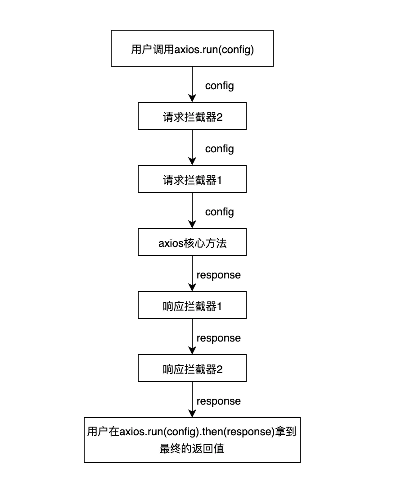
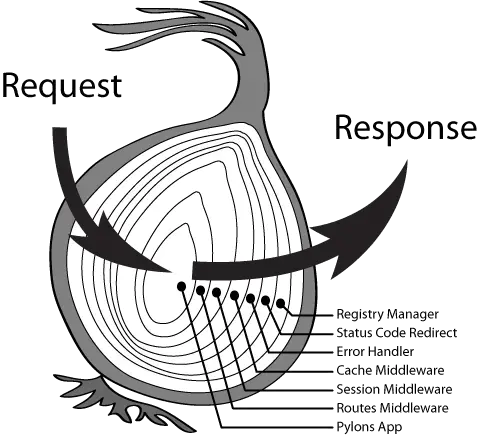

# 插件机制（中间件）

从 koa、axios、vuex 和 redux 的实现来学习如何编写属于自己的插件机制。

- 对于新手来说：
本文能让你搞明白神秘的插件和拦截器到底是什么东西。

- 对于老手来说：
在你写的开源框架中也加入拦截器或者插件机制，让它变得更加强大吧！

## axios

首先我们模拟一个简单的 axios，这里不涉及请求的逻辑，只是简单的返回一个 Promise，可以通过 config 中的 error 参数控制 Promise 的状态。

axios 的拦截器机制用流程图来表示其实就是这样的：



```js
const axios = config => {
  if (config.error) {
    return Promise.reject({
      error: "error in axios"
    })
  } else {
    return Promise.resolve({
      ...config,
      result: config.result
    })
  }
}
```

如果传入的 config 中有 error 参数，就返回一个 rejected 的 promise，反之则返回 resolved 的 promise。

先简单看一下 axios 官方提供的拦截器示例：


```js
axios.interceptors.request.use(
  function(config) {
    // 在发送请求之前做些什么
    return config;
  },
  function(error) {
    // 对请求错误做些什么
    return Promise.reject(error);
  }
);

// 添加响应拦截器
axios.interceptors.response.use(
  function(response) {
    // 对响应数据做点什么
    return response;
  },
  function(error) {
    // 对响应错误做点什么
    return Promise.reject(error);
  }
);
```

可以看出，不管是 request 还是 response 的拦截求，都会接受两个函数作为参数，一个是用来处理正常流程，一个是处理失败流程，这让人想到了什么？
没错，promise.then接受的同样也是这两个参数。
axios 内部正是利用了 promise 的这个机制，把 use 传入的两个函数作为一个intercetpor，每一个intercetpor都有resolved和rejected两个方法。


接下来简单实现一下，这里我们简化一下，把axios.interceptor.request.use转为axios.useRequestInterceptor来简单实现：

```js
const axios = config => {
  if (config.error) {
    return Promise.reject({
      error: "error in axios"
    })
  } else {
    return Promise.resolve({
      ...config,
      result: config.result
    })
  }
}


// 初始化拦截器对象
axios.interceptors = {
  request: [],
  response: []
}

// 注册请求拦截器
axios.useRequestInterceptor = (resolved, rejected) => {
  axios.interceptors.request.push({resolved, rejected})
}

// 注册响应拦截器
axios.useResponseInterceptor = (resolved, rejected) => {
  axios.interceptors.response.push({resolved, rejected})
}

// 运行拦截器的方法
axios.run = config => {
  const chain = [
    {
      resolved: axios,
      rejected: undefined
    }
  ]

  // 把请求拦截器往数组头部推
  axios.interceptors.request.forEach(interceptor => {
    chain.unshift(interceptor)
  })

  // 把响应拦截器往数组尾部推
  axios.interceptors.response.forEach(interceptor => {
    chain.push(interceptor)
  })

  // 把配置项也包装成 promise
  let promise = Promise.resolve(config)

  while (chain.length) {
    const { resolved, rejected } = chain.shift()
    promise = promise.then(resolved, rejected)
  }

  return promise

}
```

使用请求和响应的拦截器：

```js
// 使用请求拦截器
axios.useRequestInterceptor(config => {
  // 进行处理 ...

  // 返回值
  return {
    ...config,
    extraParams1: 'extraParams1'
  }
})
  
axios.useRequestInterceptor(config => {
  // 返回值
  return {
    ...config,
    extraParams2: 'extraParams2'
  }
})

// 使用响应拦截器
axios.useResponseInterceptor(
  resp => {
    const {
      extraParams1,
      extraParams2,
      message
    } = resp
    return `${extraParams1}${extraParams2}${message}`
  },
  error => {
    console.log("error", error)
  }
)
```

模拟成功的调用结果：

```js
// 成功调用
;(async function() {
  const result = await axios.run({
    message: "message1"
  });
  console.log("result1: ", result);
  // result1:  extraParams1extraParams2message1
})();
```

模拟失败的调用结果：

```js
;(async function() {
  const result = await axios.run({
    error: true
  });
  console.log("result3: ", result);
  // error { error: 'error in axios' }
  // result3:  undefined
})();
```

可以看出，axios 的拦截器是非常灵活的，可以在请求阶段任意的修改 config，也可以在响应阶段对 response 做各种处理，这也是因为用户对于请求数据的需求就是非常灵活的，没有必要干涉用户的自由度。

## vuex
vuex 提供了一个 api 用来在 action 被调用前后插入一些逻辑：
```js
class Vuex {
  state = {}
  action = {}

  _actionSubscribers = []

  constructor({ state, action }) {
    this.state = state
    this.action = action
    this._actionSubscribers = []
  }

  dispatch (action) {
    // action 前置监听器
    this._actionSubscribers.forEach(sub => sub.before(action, this.state))
    
    const { type, payload } = action

    this.action[type](this.state, payload).then(() => {
      // action 后置监听器
      this._actionSubscribers.forEach(sub => sub.after(action, this.state))
    })
  }

  subscribeAction (subscriber) {
    this._actionSubscribers.push(subscriber)
  }
}

const store = new Vuex({
  state: {
    count: 0
  },
  action: {
    async add (state, payload) {
      state.count += payload
    }
  }
})

store.subscribeAction({
  before: (action, state) => {
    console.log(`before action ${action.type}, before count is ${state.count}`);
  },
  after: (action, state) => {
    console.log(`after action ${action.type},  after count is ${state.count}`);
  }
})

store.dispatch({
  type: "add",
  payload: 2
});

```
此时控制台会打印如下内容：
```js
// before action add, before count is 0
// after action add, after count is 2
```
这样轻松实现了日志功能。
当然 Vuex 在实现插件功能的时候，选择性的将 type payload 和 state 暴露给外部，而不再提供进一步的修改能力，这也是框架内部的一种权衡，当然我们可以对 state 进行直接修改，但是不可避免的会得到 Vuex 内部的警告，因为在 Vuex 中，所有 state 的修改都应该通过 mutations 来进行，但是 Vuex 没有选择把 commit 也暴露出来，这也约束了插件的能力。


## koa

koa 的洋葱模型想必各位都听说过，这种灵活的中间件机制也让 koa 变得非常强大，本文也会实现一个简单的洋葱中间件机制。



对应这张图来看，洋葱的每一个圈就是一个中间件，它即可以掌管请求进入，也可以掌管响应返回.

首先我们写出Koa这个类:

```js
class Koa {
  constructor() {
    this.middlewares = []
  }

  // 这里的 use 就是简单的把中间件推入中间件队列中
  use (middleware) {
    this.middlewares.push(middleware)
  }

  start ({ req }) {
    const composed = composeMiddlewares(this.middlewares) // 组合中间件
    const ctx = { req, res: undefined }
    return composed(ctx)
  }
}
```

核心就是怎样去把这些中间件组合起来了，下面看composeMiddlewares方法：
```js

function composeMiddlewares (middlewares) {
  return function wrapMiddlewares (ctx) {
    let index = -1
    function dispatch (i) {
      index = i

      const fn = middlewares[i]

      // 最后一个中间件调用next 也不会报错
      if (!fn) {
        return Promise.resolve()
      }

      return Promise.resolve(fn(ctx, ()=>dispatch(i+1)))
    }

    return dispatch(0)
  }
}
```
简单来说 dispatch(n)对应着第 n 个中间件的执行，而 dispatch(n)又拥有执行 dispatch(n + 1)的权力，
所以在真正运行的时候，中间件并不是在平级的运行，而是嵌套的高阶函数：
dispatch(0)包含着 dispatch(1)，而 dispatch(1)又包含着 dispatch(2) 在这个模式下，我们很容易联想到try catch的机制，它可以 catch 住函数以及函数内部继续调用的函数的所有error。那么我们的第一个中间件就比较适合做成一个错误处理中间件.

```js
const app = new Koa()


// 第一个中间件: 最外层的中间件管控全局错误
app.use(async (ctx, next) => {
  try {
    await next()
  } catch (error) {
    console.log(`koa error: ${error.message}`)
  }
})

// 第二层日志中间件
app.use(async (ctx, next) => {
  const { req } = ctx
  console.log(`req is ${JSON.stringify(req)}`);
  await next();
  // next过后已经能拿到第三层写进ctx的数据了
  console.log(`res is ${JSON.stringify(ctx.res)}`);
})

// 第三层，业务逻辑处理中间件
app.use(async (ctx, next) => {
  const { req } = ctx;
  console.log(`calculating the res of ${req}...`);
  const res = {
    code: 200,
    result: `req ${req} success`
  };
  // 写入ctx
  ctx.res = res;
  await next();
});


// 用来测试全局错误中间件
// 注释掉这一个中间件 服务才能正常响应
app.use(async (ctx, next) => {
  throw new Error("oops! error!");
});

```

启动函数:

```js
// 启动函数
app.start({ req: "ssh" }); // 初始 ctx
```