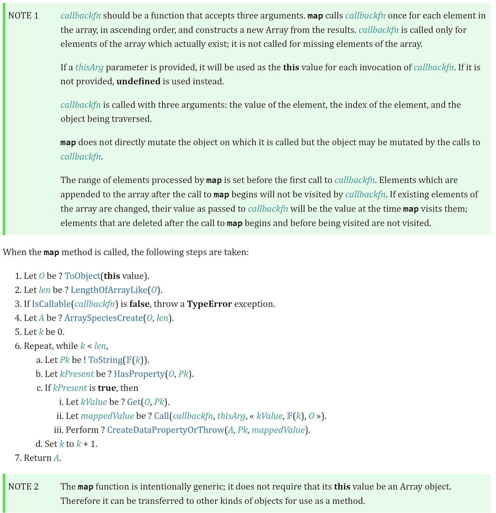

# Array.map()

## 数组的 map 方法

### 常规用法

map() 方法创建一个新数组，其结果是该数组中的每个元素都调用一个提供的函数后返回的结果。
数组执行完 map() 方法后返回一个新的数组，原数组元素不会发生改变。

```js
var array1 = [1, 4, 9, 16]

const map1 = array1.map((x) => x * 2)

console.log(map1)
// expected output: Array [2, 8, 18, 32]

console.log(array1)
// expected output: Array [1, 4, 9, 16]
```

### 参数说明

array.map(function(currentValue,index,arr),thisValue)方法一共可以传入两个参数。

第一个参数为一个函数 function(currentValue, index, arr)，该函数中又包含了三个参数:

currentValue：表示的是当前元素的值。必须值。

index：当前元素的索引（从 0 开始）。可选值。

arr：当前元素属于的数组对象。也就是执行 map 方法的原数组对象。可选值。

第二个参数 thisValue 为可选。对象作为该执行回调时使用，传递给函数，用作 “this” 的值。
如果省略了 thisValue，或者传入 null、undefined，那么回调函数的 this 为全局对象。

该参数对箭头函数无效，箭头函数没有 this 对象，所以无法改变 this 指向

## 实现 map 方法

根据[ECMA 草案](https://tc39.es/ecma262/#sec-array.prototype.map)实现 map 方法


```js
Array.prototype.map = function(callbackFn, thisArg) {
  // 处理数组类型异常
  if (this === null || this === undefined) {
    throw new TypeError("Cannot read property 'map' of null or undefined")
  }

  // 处理回调类型异常
  if (Object.prototype.toString.call(callbackFn) !== '[object Function]') {
    throw new TypeError(callbackFn + 'is not a function')
  }

  let O = Object(this) // 草案1：先转为对象
  let T = thisArg

  let len = O.length >>> 0 // 长度转整数

  let A = new Array(len)

  let k = 0

  while (k < len) {
    if (k in O) {
      let kValue = O[k]
      let mappedValue = callbackFn.call(T, kValue, k, o)
      A[k] = mappedValue
    }
    k++
  }

  return A
}
```

### 解释 length >>> 0

这里解释一下, length >>> 0, 字面意思是指"右移 0 位"，但实际上是把前面的空位用 0 填充，这里的作用是保证 len 为数字且为整数。

举几个特例：

```js
null >>> 0  //0

undefined >>> 0  //0

void(0) >>> 0  //0

function a (){};  a >>> 0  //0

[] >>> 0  //0

var a = {}; a >>> 0  //0

123123 >>> 0  //123123

45.2 >>> 0  //45

0 >>> 0  //0

-0 >>> 0  //0

-1 >>> 0  //4294967295

-1212 >>> 0  //4294966084
```

## 常见面试题解

### map() 方法陷阱题

```js
const map1 = [1, 2, 3].map(parseInt)
console.log(map1)
// (3) [1, NaN, NaN]
```

该题与函数传入的参数有关，详解见 https://www.cnblogs.com/Candybunny/p/5627905.html

parseInt 函数定义：

parseInt(string, radix);

string: 需要转化的字符，如果不是字符串会被转换，忽视空格符。

radix：数字 2-36 之前的整型。默认使用 10，表示十进制。

map 方法中 callback 的定义:

function(currentValue,index,arr)

那么实际上执行的就是：

```js
// 第一个参数是数组当前的元素，转成字符串
// 第二个参数是数组当前元素的下标
parseInt('1', 0) // 0 相当于 10 进制
parseInt('2', 1) // 不存在一进制数，返回 NaN
parseInt('3', 2) // 二进制数不存在大于 1 的数，无法转换，返回 NaN
```

## 参考

- https://blog.csdn.net/qq_18864907/article/details/89111068?spm=1001.2014.3001.5502
- http://47.98.159.95/my_blog/blogs/javascript/js-array/006.html
