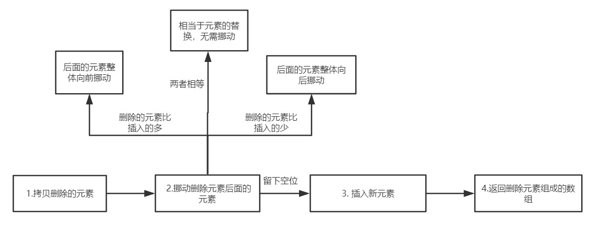

# Array.prototype.splice()

## 介绍

splice 可以说是最受欢迎的数组方法之一，api 灵活，使用方便。现在来梳理一下用法:

- splice(position, count) 表示从 position 索引的位置开始，删除 count 个元素
- splice(position, 0, ele1, ele2, ...) 表示从 position 索引的元素后面插入一系列的元素
- splice(postion, count, ele1, ele2, ...) 表示从 position 索引的位置开始，删除 count 个元素，然后再插入一系列的元素
- 返回值为被删除元素组成的数组。

## 实现

### 思路图:



### 初步实现

```js
Array.prototype.splice = function(startIndex, deleteCount, ...addElements) {
  let array = Object(this)
  let len = array.length // 原数组长度
  let deleteArr = new Array(deleteCount)
  let argumentsLen = arguments.length
  // 拷贝删除的数组
  sliceDeleteElements(array, startIndex, deleteCount, deleteArr)

  // 移动删除元素后面的元素
  movePostElements(array, startIndex, len, deleteCount, addElements)
}

// 拷贝删除的元素
const sliceDeleteElements = (array, startIndex, deleteCount, deleteArr) => {
  for (let i = 0; i < deleteCount; i++) {
    let index = startIndex + i
    if (index in array) {
      let current = array[index]
      deleteArr[i] = current
    }
  }
}

// 移动删除元素后的元素，分为三种情况
// 1. 添加的元素个数和删除的元素个数相等
// 2. 添加的元素个数小于删除元素的个数
// 3. 添加的元素个数大于删除元素的个数
const movePostElements = (array, startIndex, len, addElements) => {
  if (deleteCount === addElements.length) return
  else if (deleteCount > addElements.length) {
    // 后面的元素集体前移
    for (let i = startIndex + deleteCount; i < len; i++) {
      let fromIndex = i

      let toIndex = i - (deleteCount - addElements.length)

      if (fromIndex in array) {
        array[toIndex] = array[fromIndex]
      } else {
        delete array[toIndex]
      }
    }
    // 需要删除冗余元素
    for (let i = len - 1; i >= len + addElements.length - deleteCount; i--) {
      delete array[i]
    }
  } else {
    // deleteCount < addElements.length
    // 元素集体后移
    for (let i = len - 1; i >= startIndex + deleteCount; i--) {
      let fromIndex = i

      let toIndex = i + (addElements.length - deleteCount)

      if (fromIndex in array) {
        array[toIndex] = array[fromIndex]
      } else {
        delete array[toIndex]
      }
    }
  }
}
```

### 优化一：参数边界的情况

当用户传来非法的 startIndex 和 deleteCount 或者负索引的时候，需要我们做出特殊的处理。

```js
const computeStartIndex = (startIndex, len) => {
  if (startIndex < 0) {
    return startIndex + len > 0 ? startIndex + len : 0
  }
  return startIndex >= len ? len : startIndex
}

const computeDeleteCount = (startIndex, len, deleteCount, argumentsLen) => {
  // 删除个数没有传递，默认删除 startIndex 以及之后的元素
  if (argumentsLen === 1) {
    return len - startIndex
  }

  // 删除数目过小
  if (deleteCount < 0) {
    return 0
  }

  // 删除数目过大
  if (deleteCount > len - startIndex) {
    return len - startIndex
  }

  return deleteCount
}
```

### 优化二：数组为密封对象或冻结对象

什么是密封对象？

> 密封对象是不可扩展的对象，而且已有成员的[[Configurable]]属性被设置为 false，这意味着不能添加、删除方法和属性。但是属性值是可以修改的。

什么是冻结对象？

> 冻结对象是最严格的防篡改级别，除了包含密封对象的限制外，还不能修改属性值。

```js
// 判断 sealed 对象和 frozen 对象, 即 密封对象 和 冻结对象
if (Object.isSealed(array) && deleteCount !== addElements.length) {
  throw new TypeError('the object is a sealed object!')
} else if (
  Object.isFrozen(array) &&
  (deleteCount > 0 || addElements.length > 0)
) {
  throw new TypeError('the object is a frozen object!')
}
```

### 完整的 splice 方法

```js
const computeStartIndex = (startIndex, len) => {
  if (startIndex < 0) {
    return startIndex + len > 0 ? startIndex + len : 0
  }
  return startIndex >= len ? len : startIndex
}

const computeDeleteCount = (startIndex, len, deleteCount, argumentsLen) => {
  // 删除个数没有传递，默认删除 startIndex 以及之后的元素
  if (argumentsLen === 1) {
    return len - startIndex
  }

  // 删除数目过小
  if (deleteCount < 0) {
    return 0
  }

  // 删除数目过大
  if (deleteCount > len - startIndex) {
    return len - startIndex
  }

  return deleteCount
}

// 拷贝删除的元素
const sliceDeleteElements = (array, startIndex, deleteCount, deleteArr) => {
  for (let i = 0; i < deleteCount; i++) {
    let index = startIndex + i
    if (index in array) {
      let current = array[index]
      deleteArr[i] = current
    }
  }
}

// 移动删除元素后的元素，分为三种情况
// 1. 添加的元素个数和删除的元素个数相等
// 2. 添加的元素个数小于删除元素的个数
// 3. 添加的元素个数大于删除元素的个数
const movePostElements = (array, startIndex, len, addElements) => {
  if (deleteCount === addElements.length) return
  else if (deleteCount > addElements.length) {
    // 后面的元素集体前移
    for (let i = startIndex + deleteCount; i < len; i++) {
      let fromIndex = i

      let toIndex = i - (deleteCount - addElements.length)

      if (fromIndex in array) {
        array[toIndex] = array[fromIndex]
      } else {
        delete array[toIndex]
      }
    }
    // 需要删除冗余元素
    for (let i = len - 1; i >= len + addElements.length - deleteCount; i--) {
      delete array[i]
    }
  } else {
    // deleteCount < addElements.length
    // 元素集体后移
    for (let i = len - 1; i >= startIndex + deleteCount; i--) {
      let fromIndex = i

      let toIndex = i + (addElements.length - deleteCount)

      if (fromIndex in array) {
        array[toIndex] = array[fromIndex]
      } else {
        delete array[toIndex]
      }
    }
  }
}

Array.prototype.splice = function(startIndex, deleteCount, ...addElements) {
  let argumentsLen = arguments.length
  let array = Object(this)
  let len = array.length
  let deleteArr = new Array(deleteCount)

  startIndex = computeStartIndex(startIndex, len)
  deleteCount = computeDeleteCount(startIndex, len, deleteCount, argumentsLen)

  // 判断 sealed 对象和 frozen 对象, 即 密封对象 和 冻结对象
  if (Object.isSealed(array) && deleteCount !== addElements.length) {
    throw new TypeError('the object is a sealed object!')
  } else if (
    Object.isFrozen(array) &&
    (deleteCount > 0 || addElements.length > 0)
  ) {
    throw new TypeError('the object is a frozen object!')
  }

  // 拷贝删除的元素
  sliceDeleteElements(array, startIndex, deleteCount, deleteArr)
  // 移动删除元素后面的元素
  movePostElements(array, startIndex, len, deleteCount, addElements)

  // 插入新元素

  for (let i = 0; i < addElements; i++) {
    array[startIndex + i] = addElements[i]
  }

  array.length = len - deleteCount + addElements.length

  return deleteArr
}
```
