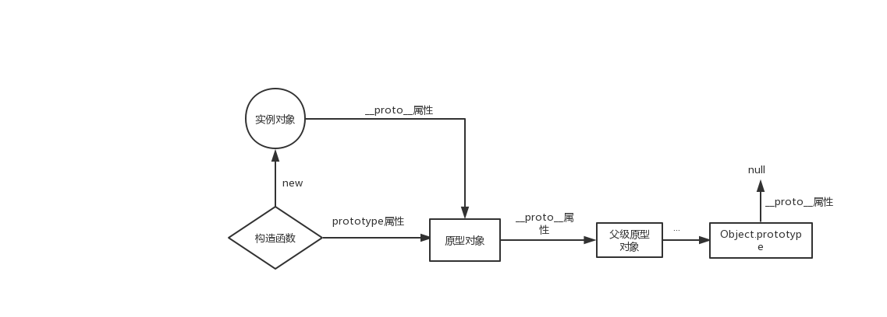

# 原型链和继承

## 原型对象和构造函数

在JavaScript中，每当定义一个函数数据类型(普通函数、类)时候，都会天生自带一个prototype属性，这个属性指向函数的原型对象。

当函数经过new调用时，这个函数就成为了构造函数，返回一个全新的实例对象，这个实例对象有一个__proto__属性，指向构造函数的原型对象。

## 描述一下原型链

JavaScript对象通过prototype指向父类对象，直到指向Object对象为止，这样就形成了一个原型指向的链条, 即原型链。

注意点：
- 对象的 hasOwnProperty() 来检查对象自身中是否含有该属性
- 使用 in 检查对象中是否含有某个属性时，如果对象中没有但是原型链中有，也会返回 true

## 继承
