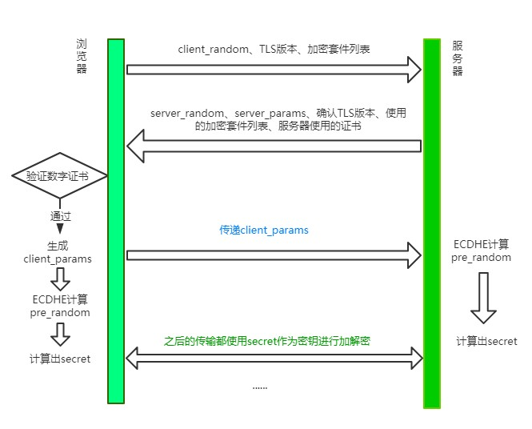
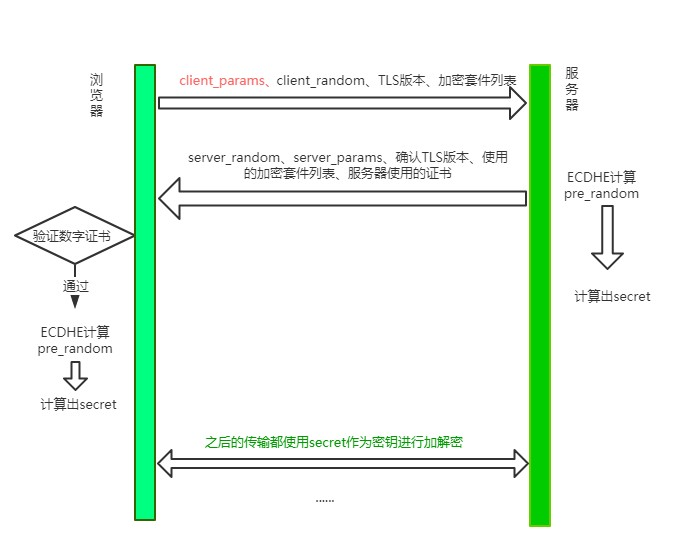

# HTTPS 和 TLS

之前谈到了 HTTP 是明文传输的协议，传输保文对外完全透明，非常不安全，那如何进一步保证安全性呢？

由此产生了 HTTPS，其实它并不是一个新的协议，而是在 HTTP 下面增加了一层 SSL/TLS 协议，简单的讲，HTTPS = HTTP + SSL/TLS。

### 那什么是 SSL/TLS 呢？

SSL 即安全套接层（Secure Sockets Layer），在 OSI 七层模型中处于会话层(第 5 层)。之前 SSL 出过三个大版本，当它发展到第三个大版本的时候才被标准化，成为 TLS（传输层安全，Transport Layer Security），并被当做 TLS1.0 的版本，准确地说，TLS1.0 = SSL3.1。

现在主流的版本是 TLS/1.2, 之前的 TLS1.0、TLS1.1 都被认为是不安全的，在不久的将来会被完全淘汰。因此我们接下来主要讨论的是 TLS1.2, 当然在 2018 年推出了更加优秀的 TLS1.3，大大优化了 TLS 握手过程，这个我们放在下一节再去说。

TLS 握手的过程比较复杂，写文章之前我查阅了大量的资料，发现对 TLS 初学者非常不友好，也有很多知识点说的含糊不清，可以说这个整理的过程是相当痛苦了。希望我下面的拆解能够帮你理解得更顺畅些吧 : ）

## 传统 RSA 握手

谈到HTTPS, 就不得不谈到与之相对的HTTP。HTTP的特性是明文传输，因此在传输的每一个环节，数据都有可能被第三方窃取或者篡改，具体来说，HTTP 数据经过 TCP 层，然后经过WIFI路由器、运营商和目标服务器，这些环节中都可能被中间人拿到数据并进行篡改，也就是我们常说的中间人攻击(HTTPS也会遭遇中间人攻击)。

为了防范这样一类攻击，我们不得已要引入新的加密方案，即 HTTPS。

HTTPS并不是一个新的协议, 而是一个加强版的HTTP。其原理是在HTTP和TCP之间建立了一个中间层，当HTTP和TCP通信时并不是像以前那样直接通信，直接经过了一个中间层进行加密，将加密后的数据包传给TCP, 响应的，TCP必须将数据包解密，才能传给上面的HTTP。这个中间层也叫安全层。安全层的核心就是对数据加解密。

### 对称加密和非对称加密

首先需要理解对称加密和非对称加密的概念，然后讨论两者应用后的效果如何。

对称加密是最简单的方式，指的是加密和解密用的是同样的密钥。

而对于非对称加密，如果有 A、 B 两把密钥，如果用 A 加密过的数据包只能用 B 解密，反之，如果用 B 加密过的数据包只能用 A 解密。

### 加解密过程

接着我们来谈谈浏览器和服务器进行协商加解密的过程。

首先，浏览器会给服务器发送一个随机数client_random 和一个加密的方法列表。

服务器接收后给浏览器返回另一个随机数server_random和加密方法。

现在，两者拥有三样相同的凭证: client_random、server_random和加密方法。

接着用这个加密方法将两个随机数混合起来生成密钥，这个密钥就是浏览器和服务端通信的暗号。

### 各自应用的效果

如果用对称加密的方式，那么第三方可以在中间获取到client_random、server_random和加密方法，由于这个加密方法同时可以解密，所以中间人可以成功对暗号进行解密，拿到数据，很容易就将这种加密方式破解了。

那能不能只用非对称加密呢？理论上是可以的，但实际上非对称加密需要的计算量非常大，对于稍微大一点的数据即使用最快的处理器也非常耗时。后面有机会给大家分享一下 RSA 非对称加密算法的原理，大家就会有更加直观的认识，这里我们先不深究。


### 对称加密和非对称加密的结合

可以发现，对称加密和非对称加密，只用前者会有安全隐患，只用后者性能消耗又太大。那我们能不能把两者结合，保证性能的同时又能保证安全呢？

其实是可以的，演示一下整个流程：

1. 浏览器向服务器发送client_random和加密方法列表。

2. 服务器接收到，返回server_random、加密方法以及公钥。

3. 浏览器接收，接着生成另一个随机数pre_random, 并且用公钥加密，传给服务器。(敲黑板！重点操作！)

4. 服务器用私钥解密这个被加密后的pre_random。

5. 现在浏览器和服务器有三样相同的凭证:client_random、server_random和pre_random。然后两者用相同的加密方法混合这三个随机数，生成最终的密钥。

现在浏览器和服务器有三样相同的凭证:client_random、server_random和pre_random。然后两者用相同的加密方法混合这三个随机数，生成最终的密钥。

然后浏览器和服务器尽管用一样的密钥进行通信，即使用对称加密。

这个最终的密钥是很难被中间人拿到的，为什么呢? 因为中间人没有私钥，从而拿不到pre_random，也就无法生成最终的密钥了。

回头比较一下和单纯的使用非对称加密, 这种方式做了什么改进呢？本质上是防止了私钥加密的数据外传。单独使用非对称加密，最大的漏洞在于服务器传数据给浏览器只能用私钥加密，这是危险产生的根源。利用对称和非对称加密结合的方式，就防止了这一点，从而保证了安全。

### 添加数字证书

尽管通过两者加密方式的结合，能够很好地实现加密传输，但实际上还是存在一些问题。黑客如果采用 DNS 劫持，将目标地址替换成黑客服务器的地址，然后黑客自己造一份公钥和私钥，照样能进行数据传输。而对于浏览器用户而言，他是不知道自己正在访问一个危险的服务器的。

事实上HTTPS在上述结合对称和非对称加密的基础上，又添加了数字证书认证的步骤。其目的就是让服务器证明自己的身份。

#### 传输过程

为了获取这个证书，服务器运营者需要向第三方认证机构获取授权，这个第三方机构也叫CA(Certificate Authority), 认证通过后 CA 会给服务器颁发数字证书。

这个数字证书有两个作用:

1. 服务器向浏览器证明自己的身份。

2. 把公钥传给浏览器。

这个验证的过程发生在什么时候呢？

当服务器传送server_random、加密方法的时候，顺便会带上数字证书(包含了公钥), 接着浏览器接收之后就会开始验证数字证书。如果验证通过，那么后面的过程照常进行，否则拒绝执行。

现在我们来梳理一下HTTPS最终的加解密过程:


#### 认证过程（证书的签发过程）

a.服务方 S 向第三方机构CA提交公钥、组织信息、个人信息(域名)等信息并申请认证；

b.CA 通过线上、线下等多种手段验证申请者提供信息的真实性，如组织是否存在、企业是否合法，是否拥有域名的所有权等；

c.如信息审核通过，CA 会向申请者签发认证文件-证书。

证书包含以下信息：申请者公钥、申请者的组织信息和个人信息、签发机构 CA 的信息、有效时间、证书序列号等信息的明文，同时包含一个签名；

签名的产生算法：首先，使用散列函数计算公开的明文信息的信息摘要，然后，采用 CA 的私钥对信息摘要进行加密，密文即签名；

d.客户端 C 向服务器 S 发出请求时，S 返回证书文件；

e.客户端 C 读取证书中的相关的明文信息，采用相同的散列函数计算得到信息摘要，然后，利用对应 CA 的公钥解密签名数据，对比证书的信息摘要，如果一致，则可以确认证书的合法性，即公钥合法；

f.客户端然后验证证书相关的域名信息、有效时间等信息；

g.客户端会内置信任 CA 的证书信息(包含公钥)，如果CA不被信任，则找不到对应 CA 的证书，证书也会被判定非法。

在这个过程注意几点：

1.申请证书不需要提供私钥，确保私钥永远只能服务器掌握；

2.证书的合法性仍然依赖于非对称加密算法，证书主要是增加了服务器信息以及签名；

3.内置 CA 对应的证书称为根证书，颁发者和使用者相同，自己为自己签名，即自签名证书；

4.证书=公钥+申请者与颁发者信息+签名；


注：CA机构用私钥加密证书的摘要生成签名，然后客户端采用 CA 的公钥解密签名，与客户端利用hash计算证书的摘要进行比对，若相同则表示证书未被串改。

### 总结

HTTPS并不是一个新的协议, 它在HTTP和TCP的传输中建立了一个安全层，利用对称加密和非对称机密结合数字证书认证的方式，让传输过程的安全性大大提高。

## TLS 1.2 握手过程

现在我们来讲讲主流的 TLS 1.2 版本所采用的方式。



刚开始你可能会比较懵，先别着急，过一遍下面的流程再来看会豁然开朗。

### step 1: Client Hello
首先，浏览器发送 client_random、TLS版本、加密套件列表。

client_random 是什么？用来最终 secret 的一个参数。

加密套件列表是什么？我举个例子，加密套件列表一般张这样:

```
TLS_ECDHE_WITH_AES_128_GCM_SHA256
```

意思是TLS握手过程中，使用ECDHE算法生成pre_random(这个数后面会介绍)，128位的AES算法进行对称加密，在对称加密的过程中使用主流的GCM分组模式，因为对称加密中很重要的一个问题就是如何分组。最后一个是哈希摘要算法，采用SHA256算法。

其中值得解释一下的是这个哈希摘要算法，试想一个这样的场景，服务端现在给客户端发消息来了，客户端并不知道此时的消息到底是服务端发的，还是中间人伪造的消息呢？现在引入这个哈希摘要算法，将服务端的证书信息通过这个算法生成一个摘要(可以理解为比较短的字符串)，用来标识这个服务端的身份，用私钥加密后把加密后的标识和自己的公钥传给客户端。客户端拿到这个公钥来解密，生成另外一份摘要。两个摘要进行对比，如果相同则能确认服务端的身份。这也就是所谓数字签名的原理。其中除了哈希算法，最重要的过程是私钥加密，公钥解密。


### step 2: Server Hello

可以看到服务器一口气给客户端回复了非常多的内容。

server_random也是最后生成secret的一个参数, 同时确认 TLS 版本、需要使用的加密套件和自己的证书，这都不难理解。那剩下的server_params是干嘛的呢？

我们先埋个伏笔，现在你只需要知道，server_random到达了客户端。

### step 3: Client 验证证书，生成secret

客户端验证服务端传来的证书和签名是否通过，如果验证通过，则传递client_params这个参数给服务器。

接着客户端通过ECDHE算法计算出pre_random，其中传入两个参数:server_params和client_params。现在你应该清楚这个两个参数的作用了吧，由于ECDHE基于椭圆曲线离散对数，这两个参数也称作椭圆曲线的公钥。

客户端现在拥有了client_random、server_random和pre_random，接下来将这三个数通过一个伪随机数函数来计算出最终的secret。

### step4: Server 生成 secret

刚刚客户端不是传了client_params过来了吗？

现在服务端开始用ECDHE算法生成pre_random，接着用和客户端同样的伪随机数函数生成最后的secret。

### 注意事项

TLS的过程基本上讲完了，但还有两点需要注意。

第一、实际上 TLS 握手是一个双向认证的过程，从 step1 中可以看到，客户端有能力验证服务器的身份，那服务器能不能验证客户端的身份呢？

当然是可以的。具体来说，在 step3中，客户端传送client_params，实际上给服务器传一个验证消息，让服务器将相同的验证流程(哈希摘要 + 私钥加密 + 公钥解密)走一遍，确认客户端的身份。

第二、当客户端生成secret后，会给服务端发送一个收尾的消息，告诉服务器之后的都用对称加密，对称加密的算法就用第一次约定的。服务器生成完secret也会向客户端发送一个收尾的消息，告诉客户端以后就直接用对称加密来通信。

这个收尾的消息包括两部分，一部分是Change Cipher Spec，意味着后面加密传输了，另一个是Finished消息，这个消息是对之前所有发送的数据做的摘要，对摘要进行加密，让对方验证一下。

当双方都验证通过之后，握手才正式结束。后面的 HTTP 正式开始传输加密报文。

## RSA 和 ECDHE 握手过程的区别

1. ECDHE 握手，也就是主流的 TLS1.2 握手中，使用ECDHE实现pre_random的加密解密，没有用到 RSA。

2. 使用 ECDHE 还有一个特点，就是客户端发送完收尾消息后可以提前抢跑，直接发送 HTTP 报文，节省了一个 RTT，不必等到收尾消息到达服务器，然后等服务器返回收尾消息给自己，直接开始发请求。这也叫TLS False Start。


## TLS 1.3 做了哪些改进？

TLS 1.2 虽然存在了 10 多年，经历了无数的考验，但历史的车轮总是不断向前的，为了获得更强的安全、更优秀的性能，在2018年就推出了 TLS1.3，对于TLS1.2做了一系列的改进，主要分为这几个部分:强化安全、提高性能。

### 强化安全

在 TLS1.3 中废除了非常多的加密算法，最后只保留五个加密套件:

- TLS_AES_128_GCM_SHA256
- TLS_AES_256_GCM_SHA384
- TLS_CHACHA20_POLY1305_SHA256
- TLS_AES_128_GCM_SHA256
- TLS_AES_128_GCM_8_SHA256

可以看到，最后剩下的对称加密算法只有 AES 和 CHACHA20，之前主流的也会这两种。分组模式也只剩下 GCM 和 POLY1305, 哈希摘要算法只剩下了 SHA256 和 SHA384 了。


那你可能会问了, 之前RSA这么重要的非对称加密算法怎么不在了？

我觉得有两方面的原因:

第一、2015年发现了FREAK攻击，即已经有人发现了 RSA 的漏洞，能够进行破解了。

第二、一旦私钥泄露，那么中间人可以通过私钥计算出之前所有报文的secret，破解之前所有的密文。

为什么？回到 RSA 握手的过程中，客户端拿到服务器的证书后，提取出服务器的公钥，然后生成pre_random并用公钥加密传给服务器，服务器通过私钥解密，从而拿到真实的pre_random。当中间人拿到了服务器私钥，并且截获之前所有报文的时候，那么就能拿到pre_random、server_random和client_random并根据对应的随机数函数生成secret，也就是拿到了 TLS 最终的会话密钥，每一个历史报文都能通过这样的方式进行破解。

但ECDHE在每次握手时都会生成临时的密钥对，即使私钥被破解，之前的历史消息并不会收到影响。这种一次破解并不影响历史信息的性质也叫前向安全性。

RSA 算法不具备前向安全性，而 ECDHE 具备，因此在 TLS1.3 中彻底取代了RSA。

### 提升性能

#### 握手改进

流程如下:



大体的方式和 TLS1.2 差不多，不过和 TLS 1.2 相比少了一个 RTT， 服务端不必等待对方验证证书之后才拿到client_params，而是直接在第一次握手的时候就能够拿到, 拿到之后立即计算secret，节省了之前不必要的等待时间。同时，这也意味着在第一次握手的时候客户端需要传送更多的信息，一口气给传完。

这种 TLS 1.3 握手方式也被叫做1-RTT握手。但其实这种1-RTT的握手方式还是有一些优化的空间的，接下来我们来一一介绍这些优化方式。

#### 会话复用

会话复用有两种方式: Session ID和Session Ticket。

先说说最早出现的Seesion ID，具体做法是客户端和服务器首次连接后各自保存会话的 ID，并存储会话密钥，当再次连接时，客户端发送ID过来，服务器查找这个 ID 是否存在，如果找到了就直接复用之前的会话状态，会话密钥不用重新生成，直接用原来的那份。

但这种方式也存在一个弊端，就是当客户端数量庞大的时候，对服务端的存储压力非常大。

因而出现了第二种方式——Session Ticket。它的思路就是: 服务端的压力大，那就把压力分摊给客户端呗。具体来说，双方连接成功后，服务器加密会话信息，用Session Ticket消息发给客户端，让客户端保存下来。下次重连的时候，就把这个 Ticket 进行解密，验证它过没过期，如果没过期那就直接恢复之前的会话状态。

这种方式虽然减小了服务端的存储压力，但与带来了安全问题，即每次用一个固定的密钥来解密 Ticket 数据，一旦黑客拿到这个密钥，之前所有的历史记录也被破解了。因此为了尽量避免这样的问题，密钥需要定期进行更换。

总的来说，这些会话复用的技术在保证1-RTT的同时，也节省了生成会话密钥这些算法所消耗的时间，是一笔可观的性能提升。

#### PSK

刚刚说的都是1-RTT情况下的优化，那能不能优化到0-RTT呢？

答案是可以的。做法其实也很简单，在发送Session Ticket的同时带上应用数据，不用等到服务端确认，这种方式被称为Pre-Shared Key，即 PSK。

这种方式虽然方便，但也带来了安全问题。中间人截获PSK的数据，不断向服务器重复发，类似于 TCP 第一次握手携带数据，增加了服务器被攻击的风险

#### 总结

TLS1.3 在 TLS1.2 的基础上废除了大量的算法，提升了安全性。同时利用会话复用节省了重新生成密钥的时间，利用 PSK 做到了0-RTT连接。

## 参考

[HTTPS(TLS1.2连接过程解析 - 基于ECDHE密钥交换算法)](https://blog.csdn.net/qq_38975553/article/details/112987893)