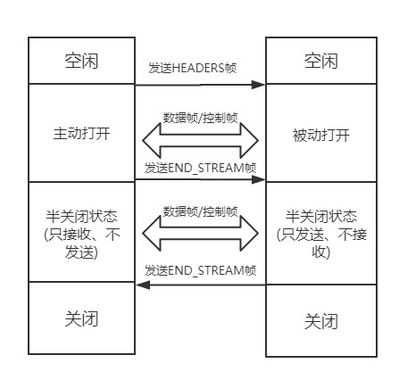

# HTTP/2

由于 HTTPS 在安全方面已经做的非常好了，HTTP 改进的关注点放在了性能方面。对于 HTTP/2 而言，它对于性能的提升主要在于两点:

- 头部压缩
- 多路复用
当然还有一些颠覆性的功能实现:

- 设置请求优先级
- 服务器推送

这些重大的提升本质上也是为了解决 HTTP 本身的问题而产生的。接下来我们来看看 HTTP/2 解决了哪些问题，以及解决方式具体是如何的。

## 头部压缩

在 HTTP/1.1 及之前的时代，请求体一般会有响应的压缩编码过程，通过Content-Encoding头部字段来指定，但你有没有想过头部字段本身的压缩呢？当请求字段非常复杂的时候，尤其对于 GET 请求，请求报文几乎全是请求头，这个时候还是存在非常大的优化空间的。HTTP/2 针对头部字段，也采用了对应的压缩算法——HPACK，对请求头进行压缩。

HPACK 算法是专门为 HTTP/2 服务的，它主要的亮点有两个：

- 首先是在服务器和客户端之间建立哈希表，将用到的字段存放在这张表中，那么在传输的时候对于之前出现过的值，只需要把索引(比如0，1，2，...)传给对方即可，对方拿到索引查表就行了。这种传索引的方式，可以说让请求头字段得到极大程度的精简和复用。

> 小贴士: HTTP/2 当中废除了起始行的概念，将起始行中的请求方法、URI、状态码转换成了头字段，不过这些字段都有一个":"前缀，用来和其它请求头区分开。

- 其次是对于整数和字符串进行哈夫曼编码，哈夫曼编码的原理就是先将所有出现的字符建立一张索引表，然后让出现次数多的字符对应的索引尽可能短，传输的时候也是传输这样的索引序列，可以达到非常高的压缩率。

## 多路复用

### HTTP 队头阻塞

我们之前讨论了 HTTP 队头阻塞的问题，其根本原因在于HTTP 基于请求-响应的模型，在同一个 TCP 长连接中，前面的请求没有得到响应，后面的请求就会被阻塞。

后面我们又讨论到用并发连接和域名分片的方式来解决这个问题，但这并没有真正从 HTTP 本身的层面解决问题，只是增加了 TCP 连接，分摊风险而已。而且这么做也有弊端，多条 TCP 连接会竞争有限的带宽，让真正优先级高的请求不能优先处理。

而 HTTP/2 便从 HTTP 协议本身解决了队头阻塞问题。注意，这里并不是指的TCP队头阻塞，而是HTTP队头阻塞，两者并不是一回事。TCP 的队头阻塞是在数据包层面，单位是数据包，前一个报文没有收到便不会将后面收到的报文上传给 HTTP，而HTTP 的队头阻塞是在 HTTP 请求-响应层面，前一个请求没处理完，后面的请求就要阻塞住。两者所在的层次不一样。

那么 HTTP/2 如何来解决所谓的队头阻塞呢？

### 二进制分帧

首先，HTTP/2 认为明文传输对机器而言太麻烦了，不方便计算机的解析，因为对于文本而言会有多义性的字符，比如回车换行到底是内容还是分隔符，在内部需要用到状态机去识别，效率比较低。于是 HTTP/2 干脆把报文全部换成二进制格式，全部传输01串，方便了机器的解析。

原来Headers + Body的报文格式如今被拆分成了一个个二进制的帧，用Headers帧存放头部字段，Data帧存放请求体数据。分帧之后，服务器看到的不再是一个个完整的 HTTP 请求报文，而是一堆乱序的二进制帧。这些二进制帧不存在先后关系，因此也就不会排队等待，也就没有了 HTTP 的队头阻塞问题。

通信双方都可以给对方发送二进制帧，这种二进制帧的双向传输的序列，也叫做流(Stream)。HTTP/2 用流来在一个 TCP 连接上来进行多个数据帧的通信，这就是多路复用的概念。

可能你会有一个疑问，既然是乱序首发，那最后如何来处理这些乱序的数据帧呢？

首先要声明的是，所谓的乱序，指的是不同 ID 的 Stream 是乱序的，但同一个 Stream ID 的帧一定是按顺序传输的。二进制帧到达后对方会将 Stream ID 相同的二进制帧组装成完整的请求报文和响应报文。当然，在二进制帧当中还有其他的一些字段，实现了优先级和流量控制等功能，我们放到下一小节再来介绍。

## HTTP/2 中的二进制帧是如何设计的？

### 帧结构

HTTP/2 中传输的帧结构如下图所示:

每个帧分为帧头和帧体。先是三个字节的帧长度，这个长度表示的是帧体的长度。

然后是帧类型，大概可以分为数据帧和控制帧两种。数据帧用来存放 HTTP 报文，控制帧用来管理流的传输。

接下来的一个字节是帧标志，里面一共有 8 个标志位，常用的有 END_HEADERS表示头数据结束，END_STREAM表示单方向数据发送结束。

后 4 个字节是Stream ID, 也就是流标识符，有了它，接收方就能从乱序的二进制帧中选择出 ID 相同的帧，按顺序组装成请求/响应报文。

### 流的状态变化

从前面可以知道，在 HTTP/2 中，所谓的流，其实就是二进制帧的双向传输的序列。那么在 HTTP/2 请求和响应的过程中，流的状态是如何变化的呢？

HTTP/2 其实也是借鉴了 TCP 状态变化的思想，根据帧的标志位来实现具体的状态改变。这里我们以一个普通的请求-响应过程为例来说明：

最开始两者都是空闲状态，当客户端发送Headers帧后，开始分配Stream ID, 此时客户端的流打开, 服务端接收之后服务端的流也打开，两端的流都打开之后，就可以互相传递数据帧和控制帧了。

当客户端要关闭时，向服务端发送END_STREAM帧，进入半关闭状态, 这个时候客户端只能接收数据，而不能发送数据。

服务端收到这个END_STREAM帧后也进入半关闭状态，不过此时服务端的情况是只能发送数据，而不能接收数据。随后服务端也向客户端发送END_STREAM帧，表示数据发送完毕，双方进入关闭状态。

如果下次要开启新的流，流 ID 需要自增，直到上限为止，到达上限后开一个新的 TCP 连接重头开始计数。由于流 ID 字段长度为 4 个字节，最高位又被保留，因此范围是 0 ~ 2的 31 次方，大约 21 亿个。

### 流的特性

刚刚谈到了流的状态变化过程，这里顺便就来总结一下流传输的特性:

- 并发性。一个 HTTP/2 连接上可以同时发多个帧，这一点和 HTTP/1 不同。这也是实现多路复用的基础。
- 自增性。流 ID 是不可重用的，而是会按顺序递增，达到上限之后又新开 TCP 连接从头开始。
- 双向性。客户端和服务端都可以创建流，互不干扰，双方都可以作为发送方或者接收方。
- 可设置优先级。可以设置数据帧的优先级，让服务端先处理重要资源，优化用户体验。

## 服务器推送

另外值得一说的是 HTTP/2 的服务器推送(Server Push)。在 HTTP/2 当中，服务器已经不再是完全被动地接收请求，响应请求，它也能新建 stream 来给客户端发送消息，当 TCP 连接建立之后，比如浏览器请求一个 HTML 文件，服务器就可以在返回 HTML 的基础上，将 HTML 中引用到的其他资源文件一起返回给客户端，减少客户端的等待。

## 总结

当然，HTTP/2 新增那么多的特性，是不是 HTTP 的语法要重新学呢？不需要，HTTP/2 完全兼容之前 HTTP 的语法和语义，如请求头、URI、状态码、头部字段都没有改变，完全不用担心。同时，在安全方面，HTTP 也支持 TLS，并且现在主流的浏览器都公开只支持加密的 HTTP/2, 因此你现在能看到的 HTTP/2 也基本上都是跑在 TLS 上面的了。最后放一张分层图给大家参考:

