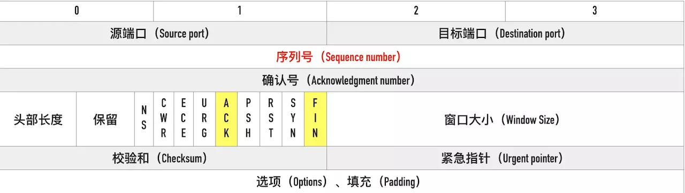

# TCP协议三次握手，四次挥手

## TCP位码

* SYN，同步位，表示是否建立连接

* FIN，终止位，表示是否关闭连接

* ACK，确认位，表示响应，确认接收到了相应序号的数据包

* seq 是自己数据包本身的序号；ack是期望对方继续发送的那个数据包的序号。

* MSL是Maximum Segment Lifetime英文的缩写，中文可以译为“报文最大生存时间”，他是任何报文在网络上存在的最长时间，超过这个时间报文将被丢弃

TCP 报文段示意图：

## 三次握手（客户端主动打开）

三次握手：由客户端A主动打开连接请求连接服务端B，代表运输连接的三个阶段：连接建立、数据传送、连接释放。

1. A 发送 SYN = 1，seq = x；表示客户端 A 发送 SYN 信号请求与服务端 B 握手同步，同时选择一个初始序号 x（随机的序号）

2. B 接受到 A 的连接请求报文，发送 SYN = 1，ACK = 1，seq = y，ack = x+1；表示服务端同意建立连接，把 SYN 位和 ACK 位都置 1，发送确认号 ack = seq + 1  = x + 1, 同时为自己也选择一个初始序号 seq = y（随机的序号）

3. A 接受到 B 的确认报文，发送 ACK = 1，ack = y+1，seq = x+1，TCP 客户A 收到 B 的确认后，还要向 B 给出确认，ACK 位置 1，携带自己的序号 seq = x + 1, 确认 B 的序列号，ack = y + 1

 

TCP 规定 SYN 报文段即使不携带数据，但是要消耗掉一个序号

## 四次挥手（客户端、服务端均可主动关闭）

数据传输结束后，通信的双方都可以释放连接。这里假设客户端主动发起关闭请求。

第一次挥手：客户端发送终止报文，报文中把 FIN 置1，seq=u（已传送过的数据最后一个字节序号+1），传送给服务端，客户端进入中止等待1状态(FIN-WAIT-1)。 客户端主动发起终止连接的报文，并发送自己当前的序列号，然后开始等待 B 的确认。

第二次挥手：服务端发送确认报文，报文中把 ACK 置1，seq=v，ack=u+1给客户端，客户端进入中止等待2状态（FIN-WAIT-2），服务器进入关闭等待状态 close-wait。服务端 B 此时确认收到客户端 A 发送的终止报文，此时的 TCP 连接处于半关闭状态，即 A 已经没有数据要发送了，但是此时如果 B 若发送数据，A 仍要接收。

第三次挥手：服务端确认没有消息要发送后，最终发送终止确认报文。报文中 FIN=1，ACK=1, seq=w, ack=u+1，w 有可能等于 v 也有可能大于 v，取决于 B 在确认与终止之间是否又发送了一些数据。

第四次挥手：客户端发送确认报文 ACK=1，seq=u+1, ack=w+1 发送给服务器，服务器收到 ACK 报文段后立即关闭，客户端等待2MSL时间后关闭。

 

TCP 规定 FIN 报文段即使不携带数据，也要消耗掉一个序号。(凡是需要对端确认的，一定消耗TCP报文的序列号。SYN 需要对端的确认， 而 ACK 并不需要，因此 SYN 消耗一个序列号而 ACK 不需要。FIN 报文段同理)

##  在TCP三次握手中，为什么客户端最后还要发送一次确认呢？（为什么不是两次）

根本原因: 无法确认客户端的接收能力。

分析如下:

如果是两次，你现在发了 SYN 报文想握手，但是这个包滞留在了当前的网络中迟迟没有到达，TCP 以为这是丢了包，于是重传，两次握手建立好了连接。

看似没有问题，但是连接关闭后，如果这个滞留在网路中的包到达了服务端呢？这时候由于是两次握手，服务端只要接收到然后发送相应的数据包，就默认建立连接，但是现在客户端已经断开了。

看到问题的吧，这就带来了连接资源的浪费。

## 三次握手过程中可以携带数据么？

第三次握手的时候，可以携带。前两次握手不能携带数据。

如果前两次握手能够携带数据，那么一旦有人想攻击服务器，那么他只需要在第一次握手中的 SYN 报文中放大量数据，那么服务器势必会消耗更多的时间和内存空间去处理这些数据，增大了服务器被攻击的风险。

第三次握手的时候，客户端已经处于ESTABLISHED状态，并且已经能够确认服务器的接收、发送能力正常，这个时候相对安全了，可以携带数据。

## 在TCP四次挥手中的第三挥手服务端为什么不直接释放连接，而是要先确认一次第二次才释放？

因为服务端在接收到FIN, 往往不会立即返回FIN, 必须等到服务端所有的报文都发送完毕了，才能发FIN。因此先发一个ACK表示已经收到客户端的FIN，延迟一段时间才发FIN。这就造成了四次挥手。

如果是三次挥手会有什么问题？

等于说服务端将ACK和FIN的发送合并为一次挥手，这个时候长时间的延迟可能会导致客户端误以为FIN没有到达客户端，从而让客户端不断的重发FIN。

## 在TCP四次挥手中的第四次挥手之后，客户端A为什么还要等待 2MSL 的时间？

如果不等待，客户端直接跑路，当服务端还有很多数据包要给客户端发，且还在路上的时候，若客户端的端口此时刚好被新的应用占用，那么就接收到了无用数据包，造成数据包混乱。所以，最保险的做法是等服务器发来的数据包都死翘翘再启动新的应用。

那，照这样说一个 MSL 不就不够了吗，为什么要等待 2 MSL?

1 个 MSL 确保四次挥手中主动关闭方最后的 ACK 报文最终能达到对端
1 个 MSL 确保对端没有收到 ACK 重传的 FIN 报文可以到达
这就是等待 2MSL 的意义。
