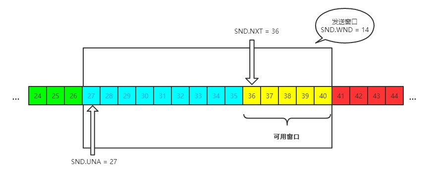
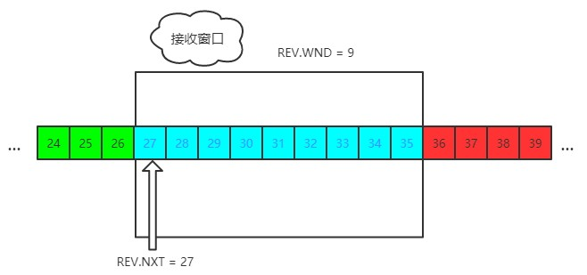

# TCP 的流量控制

对于发送端和接收端而言，TCP 需要把发送的数据放到发送缓存区, 将接收的数据放到接收缓存区。

而流量控制索要做的事情，就是在通过接收缓存区的大小，控制发送端的发送。如果对方的接收缓存区满了，就不能再继续发送了。

要具体理解流量控制，首先需要了解滑动窗口的概念。

## TCP 滑动窗口

TCP 滑动窗口分为两种: 发送窗口和接收窗口。

### 发送窗口

发送端的滑动窗口结构如下:

其中包含四大部分:

* 已发送且已确认
* 已发送但未确认
* 未发送但可以发送
* 未发送也不可以发送

其中有一些重要的概念，我标注在图中:

发送窗口就是图中被框住的范围。SND 即send, WND 即window, UNA 即unacknowledged, 表示未被确认，NXT 即next, 表示下一个发送的位置。

### 接收窗口

接收端的窗口结构如下：

REV 即 receive，NXT 表示下一个接收的位置，WND 表示接收窗口大小。

## 流量控制过程

这里我们不用太复杂的例子，以一个最简单的来回来模拟一下流量控制的过程，方便大家理解。

首先双方三次握手，初始化各自的窗口大小，均为 200 个字节。

假如当前发送端给接收端发送 100 个字节，那么此时对于发送端而言，SND. NXT 当然要右移 100 个字节，也就是说当前的可用窗口减少了 100 个字节，这很好理解。

现在这 100 个到达了接收端，被放到接收端的缓冲队列中。不过此时由于大量负载的原因，接收端处理不了这么多字节，只能处理 40 个字节，剩下的 60 个字节被留在了缓冲队列中。

注意了，此时接收端的情况是处理能力不够用啦，你发送端给我少发点，所以此时接收端的接收窗口应该缩小，具体来说，缩小 60 个字节，由 200 个字节变成了 140 字节，因为缓冲队列还有 60 个字节没被应用拿走。

因此，接收端会在 ACK 的报文首部带上缩小后的滑动窗口 140 字节，发送端对应地调整发送窗口的大小为 140 个字节。

此时对于发送端而言，已经发送且确认的部分增加 40 字节，也就是 SND. UNA 右移 40 个字节，同时发送窗口缩小为 140 个字节。

这也就是流量控制的过程。尽管回合再多，整个控制的过程和原理是一样的。
