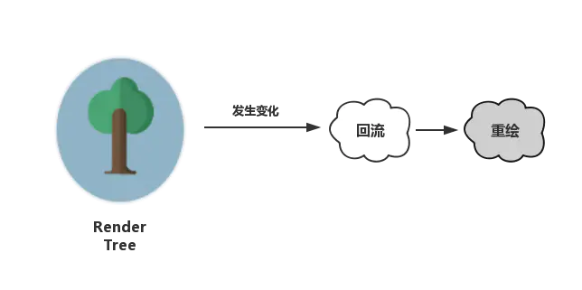

# DOM 优化原理与基本实践


## DOM 为什么这么慢

JS 是很快的，在 JS 中修改 DOM 对象也是很快的。在JS的世界里，一切是简单的、迅速的。但 DOM 操作并非 JS 一个人的独舞，而是两个模块之间的协作。

JS 引擎和渲染引擎（浏览器内核）是独立实现的。当我们用 JS 去操作 DOM 时，本质上是 JS 引擎和渲染引擎之间进行了“跨界交流”。这个“跨界交流”的实现并不简单，它依赖了桥接接口作为“桥梁”


过“桥”要收费——这个开销本身就是不可忽略的。我们每操作一次 DOM（不管是为了修改还是仅仅为了访问其值），都要过一次“桥”。过“桥”的次数一多，就会产生比较明显的性能问题。因此“减少 DOM 操作”的建议，并非空穴来风。

### 对 DOM 的修改引发样式的更迭

过桥很慢，到了桥对岸，我们的更改操作带来的结果也很慢。

很多时候，我们对 DOM 的操作都不会局限于访问，而是为了修改它。当我们对 DOM 的修改会引发它外观（样式）上的改变时，就会触发回流或重绘。

这个过程本质上还是因为我们对 DOM 的修改触发了渲染树（Render Tree）的变化所导致的：



- 回流：当我们对 DOM 的修改引发了 DOM 几何尺寸的变化（比如修改元素的宽、高或隐藏元素等）时，浏览器需要重新计算元素的几何属性（其他元素的几何属性和位置也会因此受到影响），然后再将计算的结果绘制出来。这个过程就是回流（也叫重排）。

- 重绘：当我们对 DOM 的修改导致了样式的变化、却并未影响其几何属性（比如修改了颜色或背景色）时，浏览器不需重新计算元素的几何属性、直接为该元素绘制新的样式（跳过了上图所示的回流环节）。这个过程叫做重绘。

由此我们可以看出，重绘不一定导致回流，回流一定会导致重绘。硬要比较的话，回流比重绘做的事情更多，带来的开销也更大。但这两个说到底都是吃性能的，所以都不是什么善茬。我们在开发中，要从代码层面出发，尽可能把回流和重绘的次数最小化。

## 解决方案

### 减少 DOM 操作：少交“过路费”、避免过度渲染

不要频繁地与 DOM 做交互，若有重复操作，用 JS 计算后再让 DOM 就行修改

bad:
```js
for(var count=0;count<10000;count++){ 
  document.getElementById('container').innerHTML+='<span>我是一个小测试</span>'
} 
```

good:

```js
let container = document.getElementById('container')
for(let count=0;count<10000;count++){ 
  container.innerHTML += '<span>我是一个小测试</span>'
} 
```

better:

```js
let container = document.getElementById('container')
let content = ''
for(let count=0;count<10000;count++){ 
  // 先对内容进行操作
  content += '<span>我是一个小测试</span>'
} 
// 内容处理好了,最后再触发DOM的更改
container.innerHTML = content
```

使用 DOM Fragment 改写上述例子

> DocumentFragment 接口表示一个没有父级文件的最小文档对象。它被当做一个轻量版的 Document 使用，用于存储已排好版的或尚未打理好格式的XML片段。因为 DocumentFragment 不是真实 DOM 树的一部分，它的变化不会引起 DOM 树的重新渲染的操作（reflow），且不会导致性能等问题。

```js
let container = document.getElementById('container')
// 创建一个DOM Fragment对象作为容器
let content = document.createDocumentFragment()
for(let count=0;count<10000;count++){
  // span此时可以通过DOM API去创建
  let oSpan = document.createElement("span")
  oSpan.innerHTML = '我是一个小测试'
  // 像操作真实DOM一样操作DOM Fragment对象
  content.appendChild(oSpan)
}
// 内容处理好了,最后再触发真实DOM的更改
container.appendChild(content)
```

我们运行这段代码，可以得到与前面两种写法相同的运行结果。
可以看出，DOM Fragment 对象允许我们像操作真实 DOM 一样去调用各种各样的 DOM API，我们的代码质量因此得到了保证。并且它的身份也非常纯粹：当我们试图将其 append 进真实 DOM 时，它会在乖乖交出自身缓存的所有后代节点后全身而退，完美地完成一个容器的使命，而不会出现在真实的 DOM 结构中。这种结构化、干净利落的特性，使得 DOM Fragment 作为经典的性能优化手段大受欢迎，这一点在 jQuery、Vue 等优秀前端框架的源码中均有体现。