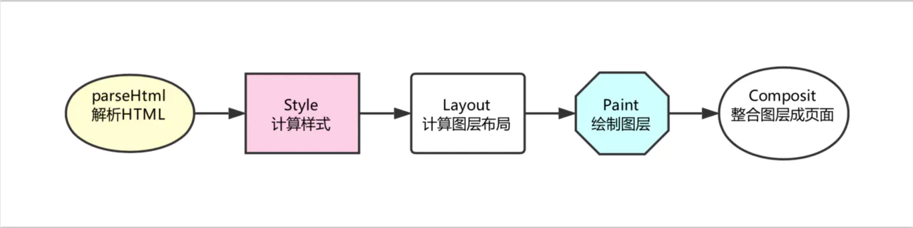

# 浏览器运行机制

## 浏览器的内核

浏览器内核可以分成两部分：渲染引擎（Layout Engine 或者 Rendering Engine）和 JS 引擎。早期渲染引擎和 JS 引擎并没有十分明确的区分，但随着 JS 引擎越来越独立，内核也成了渲染引擎的代称（下文我们将沿用这种叫法）。渲染引擎又包括了 HTML 解释器、CSS 解释器、布局、网络、存储、图形、音视频、图片解码器等等零部件。

目前市面上常见的浏览器内核可以分为这四种：Trident（IE）、Gecko（火狐）、Blink（Chrome、Opera）、Webkit（Safari）。

这里面大家最耳熟能详的可能就是 Webkit 内核了。很多同学可能会听说过 Chrome 的内核就是 Webkit，殊不知 Chrome 内核早已迭代为了 Blink。但是换汤不换药，Blink 其实也是基于 Webkit 衍生而来的一个分支，因此，Webkit 内核仍然是当下浏览器世界真正的霸主。

下面我们就以 Webkit 为例，对现代浏览器的渲染过程进行一个深度的剖析。

## 渲染过程

什么是渲染过程？简单来说，渲染引擎根据 HTML 文件描述构建相应的数学模型，调用浏览器各个零部件，从而将网页资源代码转换为图像结果，这个过程就是渲染过程（如下图）


从这个流程来看，浏览器呈现网页这个过程，宛如一个黑盒。在这个神秘的黑盒中，有许多功能模块，内核内部的实现正是这些功能模块相互配合协同工作进行的。其中我们最需要关注的，就是HTML 解释器、CSS 解释器、图层布局计算模块、视图绘制模块与JavaScript 引擎这几大模块：

- HTML 解释器：将 HTML 文档经过词法分析输出 DOM 树。
- CSS 解释器：解析 CSS 文档, 生成样式规则。
- 图层布局计算模块：布局计算每个对象的精确位置和大小。
- 视图绘制模块：进行具体节点的图像绘制，将像素渲染到屏幕上。
- JavaScript 引擎：编译执行 Javascript 代码。

## 浏览器渲染过程解析

有了对零部件的了解打底，我们就可以一起来走一遍浏览器的渲染流程了。在浏览器里，每一个页面的首次渲染都经历了如下阶段（图中箭头不代表串行，有一些操作是并行进行的，下文会说明）：



- 解析 HTML

在这一步浏览器执行了所有的加载解析逻辑，在解析 HTML 的过程中发出了页面渲染所需的各种外部资源请求。

- 计算样式

浏览器将识别并加载所有的 CSS 样式信息与 DOM 树合并，最终生成页面 render 树（:after :before 这样的伪元素会在这个环节被构建到 DOM 树中）。

- 计算图层布局

页面中所有元素的相对位置信息，大小等信息均在这一步得到计算。

- 绘制图层

在这一步中浏览器会根据我们的 DOM 代码结果，把每一个页面图层转换为像素，并对所有的媒体文件进行解码。

- 整合图层，得到页面

最后一步浏览器会合并合各个图层，将数据由 CPU 输出给 GPU 最终绘制在屏幕上。（复杂的视图层会给这个阶段的 GPU 计算带来一些压力，在实际应用中为了优化动画性能，我们有时会手动区分不同的图层）。


## 几棵重要的“树”

上面的内容没有理解透彻？别着急，我们一起来捋一捋这个过程中的重点——树！

为了使渲染过程更明晰一些，我们需要给这些”树“们一个特写:


- DOM 树： 解析 HTML 以创建的 DOM 树（DOM tree）：渲染引擎开始解析 HTML 文档，转换树种的标签到 DOM 节点，它被称为“内容树”。

- CSSOM 树：解析 CSS（包括外部 CSS 文件和样式元素）创建的是 CSSOM 树。CSSOM 的解析过程与 DOM 的解析过程是并行的。

- 渲染树：CSSOM 与 DOM 结合，之后我们得到的就是渲染树（Render tree ）。

- 布局渲染树：从根节点递归调用，计算每一个元素的大小、位置等，给每个节点所应该出现在屏幕上的精确坐标，我们便得到了基于渲染树的布局渲染树（Layout of the render tree）。

- 绘制渲染树: 遍历渲染树，每个节点将使用 UI 后端层来绘制。整个过程叫做绘制渲染树（Painting the render tree）。

## 基于渲染流程的 CSS 优化建议

在给出 CSS 选择器方面的优化建议之前，先告诉大家一个小知识：CSS 引擎查找样式表，对每条规则都按从右到左的顺序去匹配。 看如下规则：
```css
#myList  li {}
```

这样的写法其实很常见。大家平时习惯了从左到右阅读的文字阅读方式，会本能地以为浏览器也是从左到右匹配 CSS 选择器的，因此会推测这个选择器并不会费多少力气：#myList 是一个 id 选择器，它对应的元素只有一个，查找起来应该很快。定位到了 myList 元素，等于是缩小了范围后再去查找它后代中的 li 元素，没毛病。

事实上，CSS 选择符是从右到左进行匹配的。我们这个看似“没毛病”的选择器，实际开销相当高：浏览器必须遍历页面上每个 li 元素，并且每次都要去确认这个 li 元素的父元素 id 是不是 myList，你说坑不坑！

说到坑，不知道大家还记不记得这个经典的通配符：

```css
* {}
```

入门 CSS 的时候，不少同学拿通配符清除默认样式（我曾经也是通配符用户的一员）。但这个家伙很恐怖，它会匹配所有元素，所以浏览器必须去遍历每一个元素！大家低头看看自己页面里的元素个数，是不是心凉了——这得计算多少次呀！

这样一看，一个小小的 CSS 选择器，也有不少的门道！好的 CSS 选择器书写习惯，可以为我们带来非常可观的性能提升。根据上面的分析，我们至少可以总结出如下性能提升的方案：

- 避免使用通配符，只对需要用到的元素进行选择。
- 关注可以通过继承实现的属性，避免重复匹配重复定义。
- 少用标签选择器。如果可以，用类选择器替代，举例：

错误示范：
```css
#myList li{}
```
课代表：
```css
.myList_li {}
```
- 不要画蛇添足，id 和 class 选择器不应该被多余的标签选择器拖后腿。举例：
错误示范：

```css
.myList#title
```
```css
#title
```

- 减少嵌套。后代选择器的开销是最高的，因此我们应该尽量将选择器的深度降到最低（最高不要超过三层），尽可能使用类来关联每一个标签元素。

## CSS 与 JS 的加载顺序优化

HTML、CSS 和 JS，都具有阻塞渲染的特性。

HTML 阻塞，天经地义——没有 HTML，何来 DOM？没有 DOM，渲染和优化，都是空谈。

那么 CSS 和 JS 的阻塞又是怎么回事呢？

### CSS 的阻塞

在刚刚的过程中，我们提到 DOM 和 CSSOM 合力才能构建渲染树。这一点会给性能造成严重影响：默认情况下，CSS 是阻塞的资源。浏览器在构建 CSSOM 的过程中，不会渲染任何已处理的内容。即便 DOM 已经解析完毕了，只要 CSSOM 不 OK，那么渲染这个事情就不 OK（这主要是为了避免没有 CSS 的 HTML 页面丑陋地“裸奔”在用户眼前）。

我们知道，只有当我们开始解析 HTML 后、解析到 link 标签或者 style 标签时，CSS 才登场，CSSOM 的构建才开始。很多时候，DOM 不得不等待 CSSOM。因此我们可以这样总结：

> CSS 是阻塞渲染的资源。需要将它尽早、尽快地下载到客户端，以便缩短首次渲染的时间。

事实上，现在很多团队都已经做到了尽早（将 CSS 放在 head 标签里）和尽快（启用 CDN 实现静态资源加载速度的优化）。这个“把 CSS 往前放”的动作，对很多同学来说已经内化为一种编码习惯。那么现在我们还应该知道，这个“习惯”不是空穴来风，它是由 CSS 的特性决定的。

### JS 的阻塞

不知道大家注意到没有，前面我们说过程的时候，花了很多笔墨去说 HTML、说 CSS。相比之下，JS 的出镜率也太低了点。
这当然不是因为 JS 不重要。而是因为，在首次渲染过程中，JS 并不是一个非登场不可的角色——没有 JS，CSSOM 和 DOM 照样可以组成渲染树，页面依然会呈现——即使它死气沉沉、毫无交互。

JS 的作用在于修改，它帮助我们修改网页的方方面面：内容、样式以及它如何响应用户交互。这“方方面面”的修改，本质上都是对 DOM 和 CSSDOM 进行修改。因此 JS 的执行会阻止 CSSOM，在我们不作显式声明的情况下，它也会阻塞 DOM。

JS 引擎是独立于渲染引擎存在的。我们的 JS 代码在文档的何处插入，就在何处执行。当 HTML 解析器遇到一个 script 标签时，它会暂停渲染过程，将控制权交给 JS 引擎。JS 引擎对内联的 JS 代码会直接执行，对外部 JS 文件还要先获取到脚本、再进行执行。等 JS 引擎运行完毕，浏览器又会把控制权还给渲染引擎，继续 CSSOM 和 DOM 的构建。 因此与其说是 JS 把 CSS 和 HTML 阻塞了，不如说是 JS 引擎抢走了渲染引擎的控制权。

现在理解了阻塞的表现与原理，我们开始思考一个问题。浏览器之所以让 JS 阻塞其它的活动，是因为它不知道 JS 会做什么改变，担心如果不阻止后续的操作，会造成混乱。但是我们是写 JS 的人，我们知道 JS 会做什么改变。假如我们可以确认一个 JS 文件的执行时机并不一定非要是此时此刻，我们就可以通过对它使用 defer 和 async 来避免不必要的阻塞，这里我们就引出了外部 JS 的三种加载方式。

### JS 的三中加载方式

- 正常模式

```html
<script src="index.js"></script>
```

这种情况下 JS 会阻塞浏览器，浏览器必须等待 index.js 加载和执行完毕才能去做其它事情。

- async 模式

```html
<script async src="index.js"></script>
```

async 模式下，JS 不会阻塞浏览器做任何其它的事情。它的加载是异步的，当它加载结束，JS 脚本会立即执行。

- defer 模式

```html
<script defer src="index.js"></script>
```

defer 模式下，JS 的加载是异步的，执行是被推迟的。等整个文档解析完成、DOMContentLoaded 事件即将被触发时，被标记了 defer 的 JS 文件才会开始依次执行。

从应用的角度来说，一般当我们的脚本与 DOM 元素和其它脚本之间的依赖关系不强时，我们会选用 async；当脚本依赖于 DOM 元素和其它脚本的执行结果时，我们会选用 defer。

通过审时度势地向 script 标签添加 async/defer，我们就可以告诉浏览器在等待脚本可用期间不阻止其它的工作，这样可以显著提升性能。

## 小结

我们知道，当 JS 登场时，往往意味着对 DOM 的操作。DOM 操作所导致的性能开销的“昂贵”，大家可能早就有所耳闻，雅虎军规里很重要的一条就是“尽量减少 DOM 访问”。

那么 DOM 到底为什么慢，我们如何去规避这种慢呢？这里我们就引出了下一个章节需要重点解释的两个概念：CSS 中的回流（Reflow）与重绘（Repaint）。