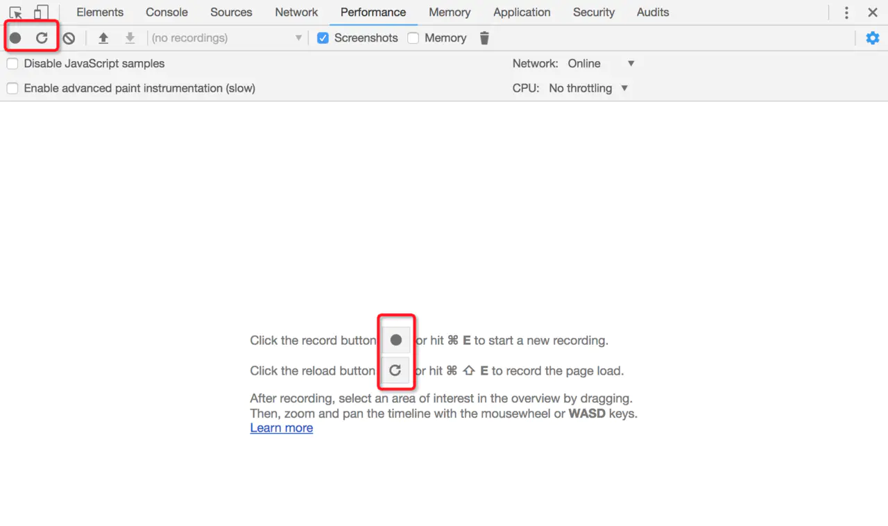
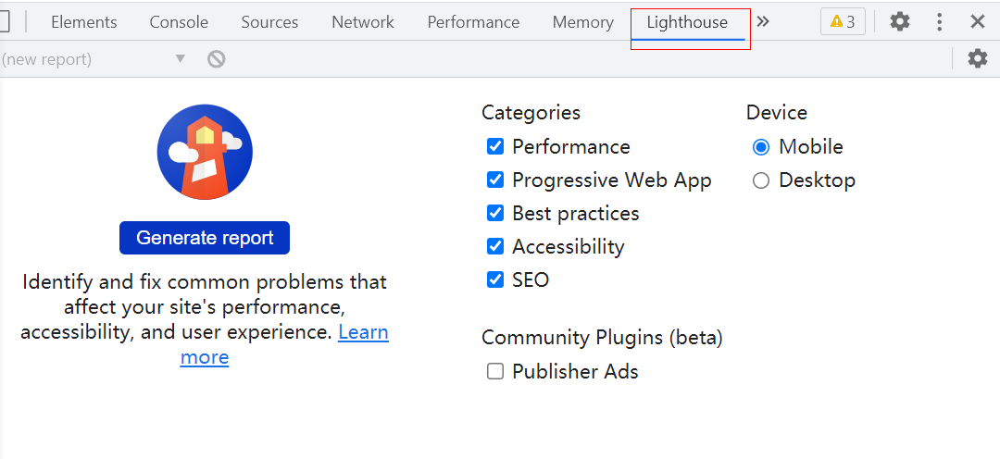
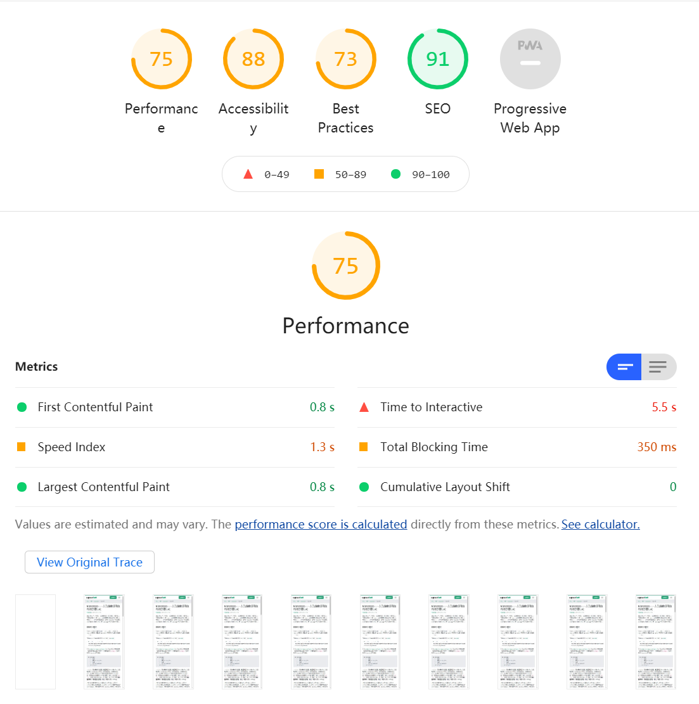
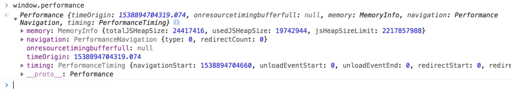
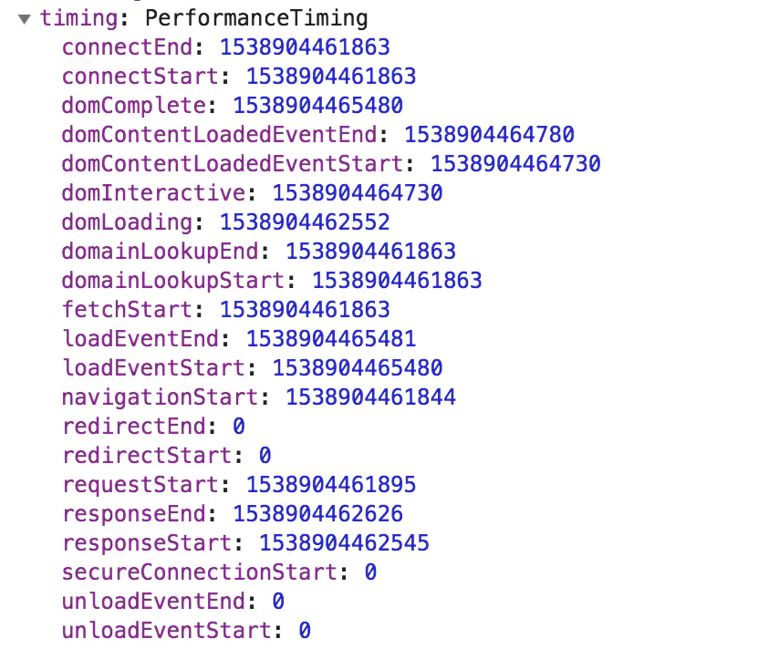
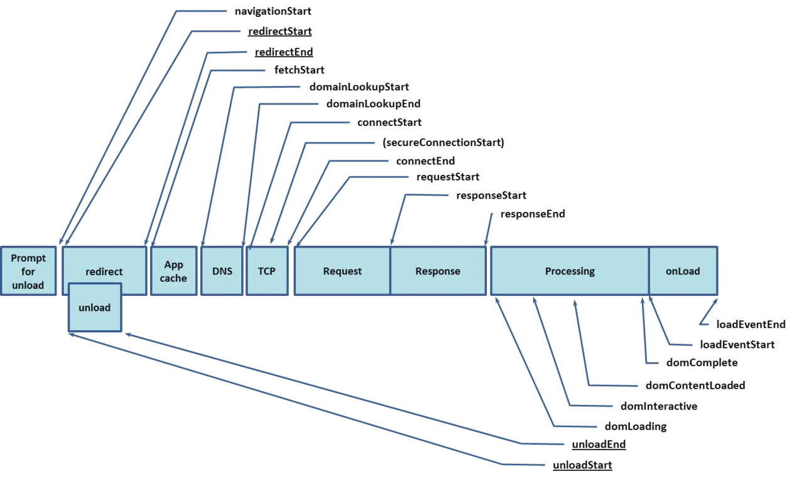

# Performance、LightHouse 与性能 API

## 可视化监测：从 Performance 面板说起

Performance 是 Chrome 提供给我们的开发者工具，用于记录和分析我们的应用在运行时的所有活动。它呈现的数据具有实时性、多维度的特点，可以帮助我们很好地定位性能问题。

### 开始记录

右键打开开发者工具，选中我们的 Performance 面板：



当我们选中图中所标示的实心圆按钮，Performance 会开始帮我们记录我们后续的交互操作；当我们选中圆箭头按钮，Performance 会将页面重新加载，计算加载过程中的性能表现。
tips：使用 Performance 工具时，为了规避其它 Chrome 插件对页面的性能影响，我们最好在无痕模式下打开页面

### 简要分析

[查看文章](https://www.jianshu.com/p/d476bd527e48)

## 可视化监测： 更加聪明的 LightHouse

从 Chrome 60 开始，DevTools 中直接加入了基于 LightHouse 的 Audits 面板：


点击 generate report 即可生成性能分析报告：



## 可编程的性能上报方案： W3C 性能 API

W3C 规范为我们提供了 Performance 相关的接口。它允许我们获取到用户访问一个页面的每个阶段的精确时间，从而对性能进行分析。我们可以将其理解为 Performance 面板的进一步细化与可编程化。

当下的前端世界里，数据可视化的概念已经被炒得非常热了，Performance 面板就是数据可视化的典范。那么为什么要把已经可视化的数据再掏出来处理一遍呢？这是因为，需要这些数据的人不止我们前端——很多情况下，后端也需要我们提供性能信息的上报。此外，Performance 提供的可视化结果并不一定能够满足我们实际的业务需求，只有拿到了真实的数据，我们才可以对它进行二次处理，去做一个更加深层次的可视化。

在这种需求背景下，我们就不得不祭出 Performance API了。

### 访问 performance 对象

performance 是一个全局对象。我们在控制台里输入 window.performance，就可一窥其全貌：




### 关键时间点
在 performance 的 timing 属性中，我们可以查看到如下的时间戳：

这些时间戳与页面整个加载流程中的关键时间节点有着一一对应的关系：


通过求两个时间点之间的差值，我们可以得出某个过程花费的时间，举个例子：
```js

const timing = window.performance.timing
// DNS查询耗时
timing.domainLookupEnd - timing.domainLookupStart
  
// TCP连接耗时
timing.connectEnd - timing.connectStart
 
// 内容加载耗时
timing.responseEnd - timing.requestStart

···
```

除了这些常见的耗时情况，我们更应该去关注一些关键性能指标：firstbyte、fpt、tti、ready 和 load 时间。这些指标数据与真实的用户体验息息相关，是我们日常业务性能监测中不可或缺的一部分：

```js
// firstbyte：首包时间	
timing.responseStart – timing.domainLookupStart	

// fpt：First Paint Time, 首次渲染时间 / 白屏时间
timing.responseEnd – timing.fetchStart

// tti：Time to Interact，首次可交互时间	
timing.domInteractive – timing.fetchStart

// ready：HTML 加载完成时间，即 DOM 就位的时间
timing.domContentLoaded – timing.fetchStart

// load：页面完全加载时间
timing.loadEventStart – timing.fetchStart
```

以上这些通过 Performance API 获取到的时间信息都具有较高的准确度。我们可以对此进行一番格式处理之后上报给服务端，也可以基于此去制作相应的统计图表，从而实现更加精准、更加个性化的性能耗时统计。

此外，通过访问 performance 的 memory 属性，我们还可以获取到内存占用相关的数据；通过对 performance 的其它属性方法的灵活运用，我们还可以把它耦合进业务里，实现更加多样化的性能监测需求——灵活，是可编程化方案最大的优点。

## 总结

本节我们介绍了 Performance 开发者工具、LightHouse 与 Performance API 三种性能监测的方案。只要有 Chrome 浏览器，我们就可以实现上述的所有操作。

由此可以看出，性能监测本身并不难。它的复杂度是在与业务发生耦合的过程中提升的。我们今天打下了坚实的地基，后续需要大家在业务中去成长、去发掘这些工具的更多的潜力，这样才能建立起属于我们自己的技术金字塔。