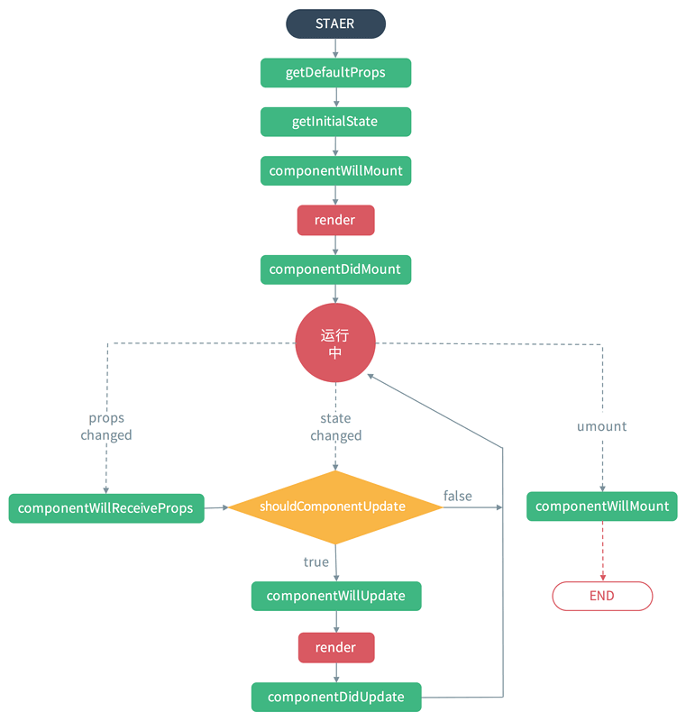

# React 生命周期

## 组件生命周期的三个阶段

- Mounting 加载阶段

1. constructor() 加载的时候调用一次，可以初始化state

2. getDefaultProps() 设置默认的props，也可以用dufaultProps设置组件的默认属性

3. getInitialState() 初始化state，可以直接在constructor中定义this.state

4. componentWillMount() 组件加载时调用，以后组件更新不调用，整个生命周期只调用一次，此时可以修改state

5. render() react最重要的步骤，创建虚拟dom，进行diff算法，更新dom树都在此进行

6. componentDidMount() 组件渲染之后调用，只调用一次

- Updating 更新阶段

1. componentWillReceiveProps(nextProps) 组件加载时不调用，组件接受新的props时调用

2. shouldComponentUpdate(nextProps, nextState) 组件接收到新的props或者state时调用，return true就会更新dom（使用diff算法更新），return false能阻止更新（不调用render）

3. componentWillUpdata(nextProps, nextState) 组件加载时不调用，只有在组件将要更新时才调用，此时可以修改state

4. render() react最重要的步骤，创建虚拟dom，进行diff算法，更新dom树都在此进行

5. componentDidUpdate() 组件加载时不调用，组件更新完成后调用

- Unmounting 卸载阶段

1. componentWillUnmount() 组件即将卸载前调用，只调用一次

## 基础写法

```js
import React, { Component } from 'react'

export default class ReactComponent15 extends Component {
    constructor(props) {
        super(props)
        // getDefaultProps：接收初始props
        // getInitialState：初始化state
    }
    state = {

    }
    componentWillMount() { // 组件挂载前触发

    }
    render() {
        return (
            <h2>Old React.Component</h2>
        )
    }
    componentDidMount() { // 组件挂载后触发

    }
    componentWillReceiveProps(nextProps) { // 接收到新的props时触发

    }
    shouldComponentUpdate(nextProps, nextState) { // 组件Props或者state改变时触发，true：更新，false：不更新
        return true
    }
    componentWillUpdate(nextProps, nextState) { // 组件更新前触发

    }
    componentDidUpdate() { // 组件更新后触发

    }
    componentWillUnmount() { // 组件卸载时触发

    }
}
```

