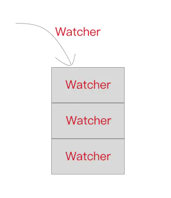

# 批量异步更新策略及 nextTick 原理

## 为什么要异步更新

通过前面几个章节我们介绍，相信大家已经明白了 Vue.js 是如何在我们修改 data 中的数据后修改视图了。简单回顾一下，这里面其实就是一个“setter -> Dep -> Watcher -> patch -> 视图”的过程。

假设我们有如下这么一种情况。

```html
<template>
  <div>
    <div>{{number}}</div>
    <div @click="handleClick">click</div>
  </div>
</template>

```
```js
export default {
    data () {
        return {
            number: 0
        };
    },
    methods: {
        handleClick () {
            for(let i = 0; i < 1000; i++) {
                this.number++;
            }
        }
    }
}
```

当我们按下 click 按钮的时候，number 会被循环增加1000次。

那么按照之前的理解，每次 number 被 +1 的时候，都会触发 number 的 setter 方法，从而根据上面的流程一直跑下来最后修改真实 DOM。那么在这个过程中，DOM 会被更新 1000 次！太可怕了。

Vue.js 肯定不会以如此低效的方法来处理。Vue.js在默认情况下，每次触发某个数据的 setter 方法后，对应的 Watcher 对象其实会被 push 进一个队列 queue 中，在下一个 tick 的时候将这个队列 queue 全部拿出来 run（ Watcher 对象的一个方法，用来触发 patch 操作） 一遍。



那么什么是下一个 tick 呢？

## nextTick

Vue.js 实现了一个 nextTick 函数，传入一个 cb ，这个 cb 会被存储到一个队列中，在下一个 tick 时触发队列中的所有 cb 事件。

因为目前浏览器平台并没有实现 nextTick 方法，所以 Vue.js 源码中分别用 Promise、setTimeout、setImmediate 等方式在 microtask（或是task）中创建一个事件，目的是在当前调用栈执行完毕以后（不一定立即）才会去执行这个事件。

笔者用 setTimeout 来模拟这个方法，当然，真实的源码中会更加复杂，笔者在小册中只讲原理，有兴趣了解源码中 nextTick 的具体实现的同学可以参考next-tick。

首先定义一个 callbacks 数组用来存储 nextTick，在下一个 tick 处理这些回调函数之前，所有的 cb 都会被存在这个 callbacks 数组中。pending 是一个标记位，代表一个等待的状态。

setTimeout 会在 task 中创建一个事件 flushCallbacks ，flushCallbacks 则会在执行时将 callbacks 中的所有 cb 依次执行。

```js
let callbacks = [];
let pending = false;

function nextTick (cb) {
    callbacks.push(cb);

    if (!pending) {
        pending = true;
        setTimeout(flushCallbacks, 0);
    }
}

function flushCallbacks () {
    pending = false;
    const copies = callbacks.slice(0);
    callbacks.length = 0;
    for (let i = 0; i < copies.length; i++) {
        copies[i]();
    }
}
```

## 再写 Watcher


第一个例子中，当我们将 number 增加 1000 次时，先将对应的 Watcher 对象给 push 进一个队列 queue 中去，等下一个 tick 的时候再去执行，这样做是对的。但是有没有发现，另一个问题出现了？

因为 number 执行 ++ 操作以后对应的 Watcher 对象都是同一个，我们并不需要在下一个 tick 的时候执行 1000 个同样的 Watcher 对象去修改界面，而是只需要执行一个 Watcher 对象，使其将界面上的 0 变成 1000 即可。

那么，我们就需要执行一个过滤的操作，同一个的 Watcher 在同一个 tick 的时候应该只被执行一次，也就是说队列 queue 中不应该出现重复的 Watcher 对象。

那么我们给 Watcher 对象起个名字吧～用 id 来标记每一个 Watcher 对象，让他们看起来“不太一样”。

实现 update 方法，在修改数据后由 Dep 来调用， 而 run 方法才是真正的触发 patch 更新视图的方法。


```js
let uid = 0

class Watcher {
  constructor () {
    this.id = ++uid;
  }

  update () {
    console.log('watch' + this.id + ' update')
    queueWatcher(this)
  }

  run () {
    console.log('watch' + this.id + '视图更新啦～');
  }
}

```

## queueWatcher

不知道大家注意到了没有？笔者已经将 Watcher 的 update 中的实现改成了

```js
queueWatcher(this);
```

将 Watcher 对象自身传递给 queueWatcher 方法。

我们来实现一下 queueWatcher 方法。

```js
let has = {}
let queue = []
let waiting = false

function queueWatcher(watcher) {
  const id = watcher.id
  if(has[id] == null) {
    has[id] = true
    queue.push(watcher)


    if(!waiting) {
      waiting = true
      nextTick(flushSchedulerQueue)
    }
  }
}
```

我们使用一个叫做 has 的 map，里面存放 id -> true ( false ) 的形式，用来判断是否已经存在相同的 Watcher 对象 （这样比每次都去遍历 queue 效率上会高很多）。

如果目前队列 queue 中还没有这个 Watcher 对象，则该对象会被 push 进队列 queue 中去。

waiting 是一个标记位，标记是否已经向 nextTick 传递了 flushSchedulerQueue 方法，在下一个 tick 的时候执行 flushSchedulerQueue 方法来 flush 队列 queue，执行它里面的所有 Watcher 对象的 run 方法。

## flushSchedulerQueue

```js
function flushSchedulerQueue () {
    let watcher, id;

    for (index = 0; index < queue.length; index++) {
        watcher = queue[index];
        id = watcher.id;
        has[id] = null;
        watcher.run();
    }

    waiting  = false;
}
```

## 举个例子

```js
let watch1 = new Watcher();
let watch2 = new Watcher();

watch1.update();
watch1.update();
watch2.update();
```
我们现在 new 了两个 Watcher 对象，因为修改了 data 的数据，所以我们模拟触发了两次 watch1 的 update 以及 一次 watch2 的 update。

假设没有批量异步更新策略的话，理论上应该执行 Watcher 对象的 run，那么会打印。

```
watch1 update
watch1视图更新啦～
watch1 update
watch1视图更新啦～
watch2 update
watch2视图更新啦～
```

实际上则执行

```
watch1 update
watch1 update
watch2 update
watch1视图更新啦～
watch2视图更新啦～
```

这就是异步更新策略的效果，相同的 Watcher 对象会在这个过程中被剔除，在下一个 tick 的时候去更新视图，从而达到对我们第一个例子的优化。

我们再回过头聊一下第一个例子， number 会被不停地进行 ++ 操作，不断地触发它对应的 Dep 中的 Watcher 对象的 update 方法。然后最终 queue 中因为对相同 id 的 Watcher 对象进行了筛选，从而 queue 中实际上只会存在一个 number 对应的 Watcher 对象。在下一个 tick 的时候（此时 number 已经变成了 1000），触发 Watcher 对象的 run 方法来更新视图，将视图上的 number 从 0 直接变成 1000。

到这里，批量异步更新策略及 nextTick 原理已经讲完了，接下来让我们学习一下 Vuex 状态管理的工作原理。