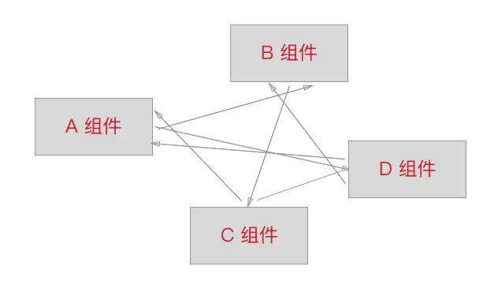

# Vuex 状态管理的工作原理

## 为什么要使用 Vuex

当我们使用 Vue.js 来开发一个单页应用时，经常会遇到一些组件间共享的数据或状态，或是需要通过 props 深层传递的一些数据。在应用规模较小的时候，我们会使用 props、事件等常用的父子组件的组件间通信方法，或者是通过事件总线来进行任意两个组件的通信。但是当应用逐渐复杂后，问题就开始出现了，这样的通信方式会导致数据流异常地混乱。



这个时候，我们就需要用到我们的状态管理工具 Vuex 了。Vuex 是一个专门为 Vue.js 框架设计的、专门用来对于 Vue.js 应用进行状态管理的库。它借鉴了 Flux、redux 的基本思想，将状态抽离到全局，形成一个 Store。因为 Vuex 内部采用了 new Vue 来将 Store 内的数据进行「响应式化」，所以 Vuex 是一款利用 Vue 内部机制的库，与 Vue 高度契合，与 Vue 搭配使用显得更加简单高效，但缺点是不能与其他的框架（如 react）配合使用。

## 安装

Vue.js 提供了一个 Vue.use 的方法来安装插件，内部会调用插件提供的 install 方法。

```js
Vue.use(Vuex);
```

所以我们的插件需要提供一个 install 方法来安装。


```js
let Vue;

export default install (_Vue) {
    Vue.mixin({ beforeCreate: vuexInit });
    Vue = _Vue;
}
```

我们采用 Vue.mixin 方法将 vuexInit 方法混淆进 beforeCreate 钩子中，并用 Vue 保存 Vue 对象。那么 vuexInit 究竟实现了什么呢？

我们知道，在使用 Vuex 的时候，我们需要将 store 传入到 Vue 实例中去。

```js
/*将store放入Vue创建时的option中*/
new Vue({
    el: '#app',
    store
});
```

但是我们却在每一个 vm 中都可以访问该 store，这个就需要靠 vuexInit 了。

```js
function vuexInit () {
    const options = this.$options;
    if (options.store) {
        this.$store = options.store;
    } else {
        this.$store = options.parent.$store;
    }
}
```

因为之前已经用Vue.mixin 方法将 vuexInit 方法混淆进 beforeCreate 钩子中，所以每一个 vm 实例都会调用 vuexInit 方法。

如果是根节点（$options中存在 store 说明是根节点），则直接将 options.store 赋值给 this.$store。否则则说明不是根节点，从父节点的 $store 中获取。

通过这步的操作，我们已经可以在任意一个 vm 中通过 this.$store 来访问 Store 的实例啦～

## Store

### 数据的响应式化

首先我们需要在 Store 的构造函数中对 state 进行「响应式化」。

```js
constructor () {
    this._vm = new Vue({
        data: {
            ?state: this.state
        }
    })
}
```

熟悉「响应式」的同学肯定知道，这个步骤以后，state 会将需要的依赖收集在 Dep 中，在被修改时更新对应视图。我们来看一个小例子。

```js
let globalData = {
    d: 'hello world'
};
new Vue({
    data () {
        return {
            ?state: {
                globalData
            }
        }
    }
});

/* modify */
setTimeout(() => {
    globalData.d = 'hi~';
}, 1000);

Vue.prototype.globalData = globalData;
```

任意模板中

```html
<div>{{globalData.d}}</div>
```

```html
上述代码在全局有一个 `globalData`，它被传入一个 Vue 对象的 data 中，
之后在任意 Vue 模板中对该变量进行展示，因为此时 `globalData` 已经在 Vue 的 prototype 上了所以直接通过 `this.prototype` 访问，
也就是在模板中的 `{{globalData.d}}`。此时，setTimeout 在 1s 之后将 `globalData.d` 进行修改，我们发现模板中的 `globalData.d` 发生了变化。其实上述部分就是 Vuex 依赖 Vue 核心实现数据的“响应式化”。
```

讲完了 Vuex 最核心的通过 Vue 进行数据的「响应式化」，接下来我们再来介绍两个 Store 的 API。

### commit


首先是 commit 方法，我们知道 commit 方法是用来触发 mutation 的。

```js
commit (type, payload, _options) {
    const entry = this._mutations[type];
    entry.forEach(function commitIterator (handler) {
        handler(payload);
    });
}
```

从 _mutations 中取出对应的 mutation，循环执行其中的每一个 mutation。

### dispatch

dispatch 同样道理，用于触发 action，可以包含异步状态。

```js
dispatch (type, payload) {
    const entry = this._actions[type];

    return entry.length > 1
    ? Promise.all(entry.map(handler => handler(payload)))
    : entry[0](payload);
}
```

同样的，取出 _actions 中的所有对应 action，将其执行，如果有多个则用 Promise.all 进行包装。


## 最后

理解 Vuex 的核心在于理解其如何与 Vue 本身结合，如何利用 Vue 的响应式机制来实现核心 Store 的「响应式化」。

Vuex 本身代码不多且设计优雅，非常值得一读，想阅读源码的同学请看Vuex源码。